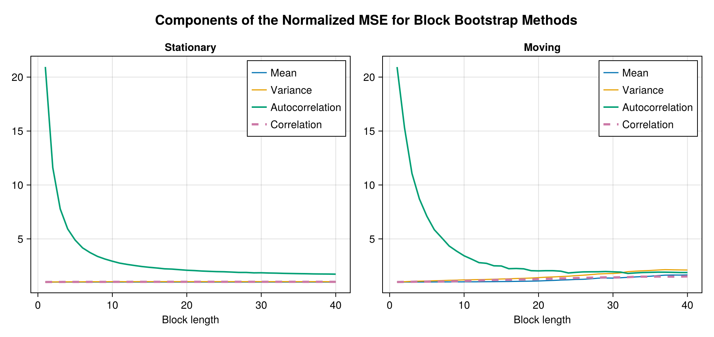
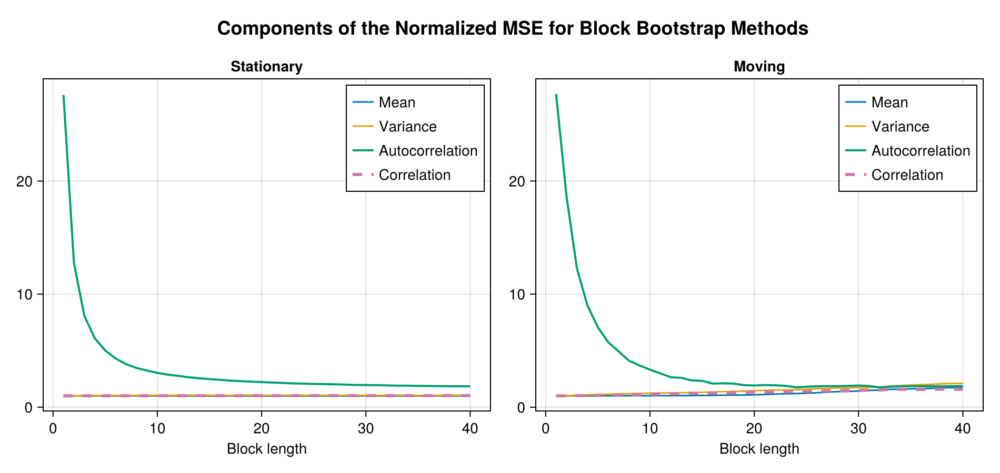
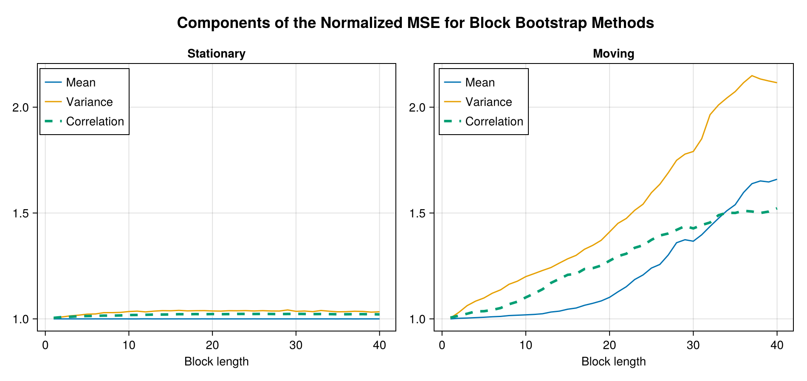
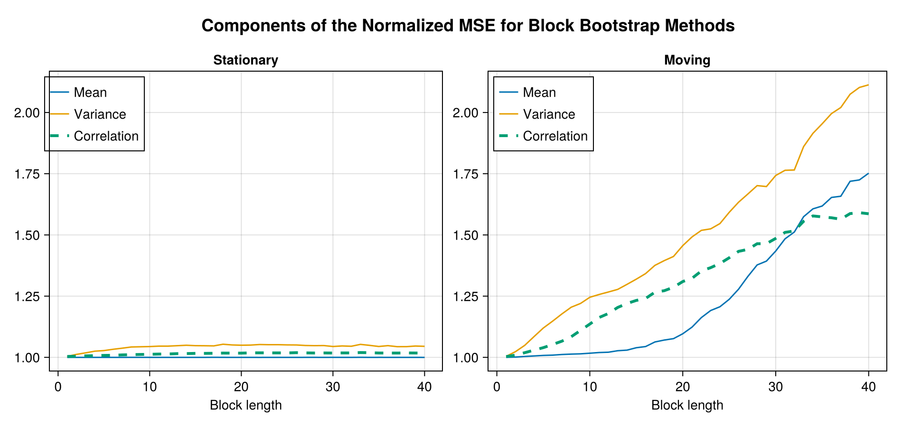
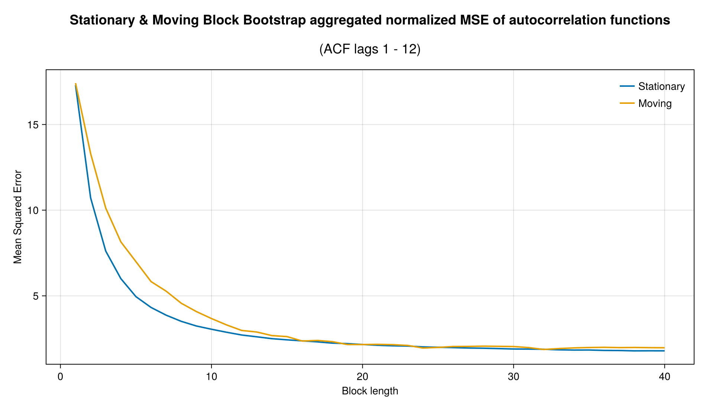
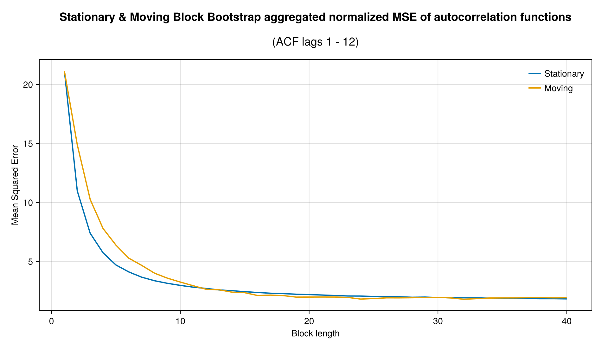

- El cambio intertrimestral anualizado es una medida más sensible a los movimientos recientes. Si hay un choque en un trimestre, la tasa anualizada puede moverse mucho.

- El cambio interanual es más suave, porque resume lo ocurrido durante 12 meses. Por eso cambia más lentamente. Es más estable, pero puede reaccionar con rezago.

# Revisar las series DLAs de los PIBs para ver quiebres estructurales y entender por qué los MSEs quedan tan grandes.

```{julia}
#| echo: false
#| warning: false
using DrWatson
@quickactivate "ModelsDataAnalysis"

using CairoMakie

include(scriptsdir("load_data.jl"))
## Load data
WITH_REMITTANCES = true  # Configuration: choose whether to include remittances in the analysis
DLA_DATA = load_dla_data(WITH_REMITTANCES)

fig = Figure(; size=(600, 500), fontsize=16)

ax = Axis(fig[1, 1]; title="PIB", subtitle="Inetrno y Externo", xticklabelrotation=π / 4)
numdates = datetime2rata.(DLA_DATA.Date)
lines!(ax, numdates, DLA_DATA[:, :DLA_GDP]; label="Interno")
lines!(ax, numdates, DLA_DATA[:, :DLA_GDP_RW]; label="Externo")
s = 8
plot_dates = datetime2rata.(DLA_DATA.Date)[begin:s:end]
strdates = Dates.format.(DLA_DATA.Date, "u yyyy")[begin:s:end]
# Add final date
if datetime2rata(DLA_DATA.Date[end]) ∉ plot_dates
    pop!(plot_dates)
    pop!(strdates)
    append!(plot_dates, datetime2rata(DLA_DATA.Date[end]))
    append!(strdates, [Dates.format(DLA_DATA.Date[end], "u yyyy")])
end

ax.xticks = (plot_dates, strdates)
# Legend
Legend(fig[2, 1], ax; orientation=:horizontal)
fig
```


```{julia}

fig = Figure(; size=(600, 500), fontsize=16)
ax = Axis(fig[1, 1]; title="PIB", subtitle="Inetrno y Externo", xticklabelrotation=π / 4)
numdates = datetime2rata.(d4l_data.Date)

lines!(ax, numdates, d4l_data[:, :D4L_GDP]; label="Interno")
lines!(ax, numdates, d4l_data[:, :D4L_GDP_RW]; label="Externo")
s = 8
plot_dates = datetime2rata.(d4l_data.Date)[begin:s:end]
strdates = Dates.format.(d4l_data.Date, "u yyyy")[begin:s:end]
# Add final date
if datetime2rata(d4l_data.Date[end]) ∉ plot_dates
    pop!(plot_dates)
    pop!(strdates)
    append!(plot_dates, datetime2rata(d4l_data.Date[end]))
    append!(strdates, [Dates.format(d4l_data.Date[end], "u yyyy")])
end

ax.xticks = (plot_dates, strdates)
# Legend
Legend(fig[2, 1], ax; orientation=:horizontal)
fig
```


Los MSE de las varianzas normalizadas son similares a las de las series en variaciones interanuales. 


 
# Cuál es el mínimo en bloques para MBB? 


El tamaño de bloque MBB para  β=0.95 es L=11. El mínimo se encuentra en L=19.


# Comparar las métricas normalizadas en los mínimos entre calibración para D4Ls y DLAs. ¿En qué transformación se alcanza menor error, o no importa?


::: {#fig-comp layout-nrow=2}





Componentes del MSE normalizado.
:::


::: {#fig-comps-nacf layout-nrow=2}






Componentes sin la autocorrelación.
:::


## Autocorrelación 

::: {#fig-elephants layout-nrow=2}





Promedio de autocorrelaación normalizada de los primeros 12 lags
:::

La transformación con más cambio es la autocorrelación.

La autocorrelación de la serie interanual es más suave, más estable. Conforme los  tamaños de bloque aumentan el MSE normalizado se reduce más "bruscamente", la serie interanual parece más suave, persistente y dominada por frecuencias bajas, capta mejor la autocorrelación.


