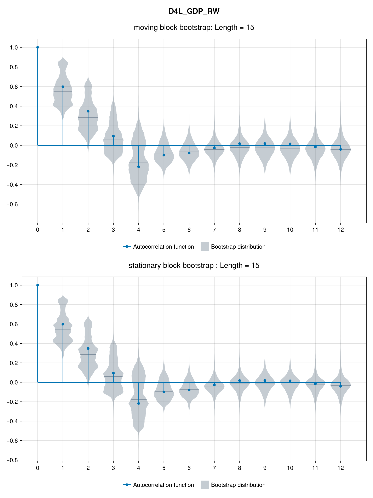
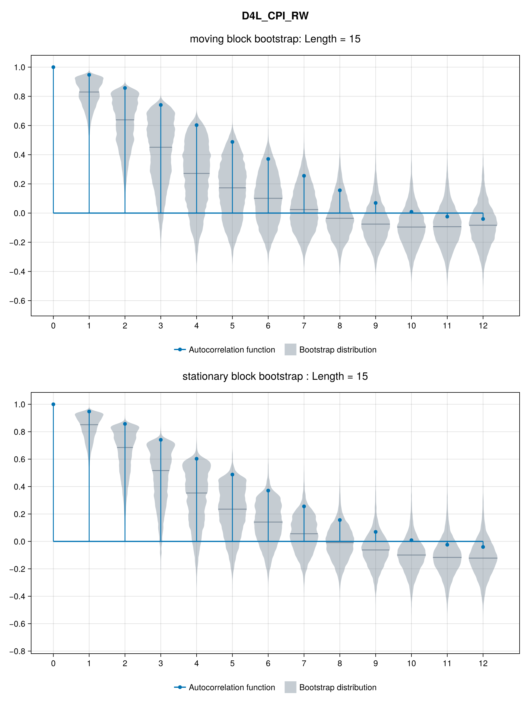

# Autocorrelation Function Analysis

## Autocorrelation Functions of Moving and Stationary Block Bootstrap
We show the autocorrelation functions for all variables and four length blocks (1, 5, 10 and 15) of Stationary and Moving Block Bootstrap.

### Real GDP of the US (D4L_GDP_RW)

### PCE core inflation (D4L_CPI_RW)

### Effective Federal Funds Rate (RS_RW)

### Domestic real GDP (D4L_GDP)

### Total domestic inflation (D4L_CPI)

### Domestic core inflation (D4L_CPIXFE)

### Exchange rate (GTQ/USD) (D4L_S)

### Monetary base (D4L_MB)

### Monetary policy rate (RS)

