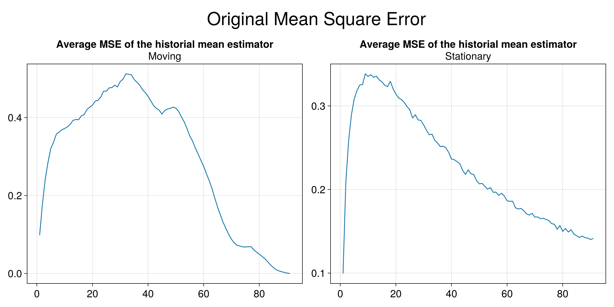
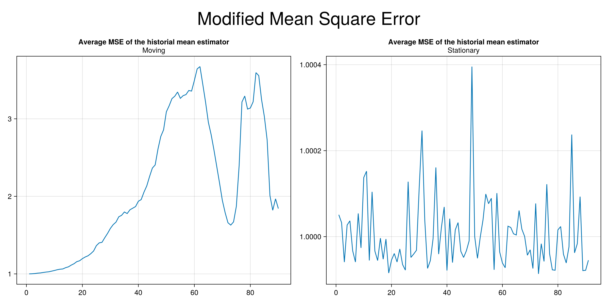

# Block Bootstrap Simulation Exercise

## Bootstraping methods for dependent data
In the literature there are some methods for dependent data. Some of them are named as "first generation methods" and take as a basis a block that is of fixed length or changes at each iteration and then resampling theese bloks until they replicates the length of the original sample.

## Moving Block Bootstrap (MBB)
We start from a given sample size $X_n \equiv \{X_1,...,X_n\}$. And then we define a block of length $l$, with $l$ being an even number that satisfies $1\leq l \leq n$. Once we have defined the block length we form different blocks of length $l$ contained in $X_n$ as follows.

$B_1 = (X_1, X_2, ... ,X_l)$
$B_2 = (X_2, X_3, ... ,X_{l+1})$
$... ... ...$
$B_N = (X_{n-l+1}, ... ,X_n)$

$N = n-l+1$ denotes the number of total blocks of length $l$ that will be formed and on which the bootstrap will be applied. Allowing the overlapping of the blocks in each iteration until the original sample length is reached. After the n bootstrap observations are formed, we proceed to estimate the statistic of interest (mean, variance, autocorrelation function or some other).

## Stationary Block Bootstrap (SBB)
As Moving Block Bootstrap we have a sample of $N$ observations of which we assume that they are stationary and time dependent. This method has the property of producing stationary pseudo time series.

The SBB method shares with the MBB the characteristic of working with blocks of time series that when joined together generate a “single block” of length $N$ as that of the original sample. The difference between SBB and MBB is that the block length in SBB changes at each iteration and in MBB the length is fixed. The algorithm as follows:

Let $X_1^*$ be an observation drawn at random from the original $N$ observations. $X_1^*$ is the first observation of the first block, so $X_1^*$ is defined as $X_1^* = X_{I_1}$. The next one has probability $p$ of being randomly drawn from the original $N$ observations and probability $1-p$ of being $X_2^* = X_{I_1+1}$ which be the next one in the original sample. The process ends when the $X_j^*$ is to be drawn at random from the original $N$ observations, this being the first observation of the next block. The iteration ends when we have a number of blocks that being joined together formed a "single block" of length $N$. So, the average length of the blocks is $\frac{1}{p}$.

## Basic simulation exercise
In our exercise, the objetive is to sample pseudo datasets using bootstrapping methods on the time series used for building macroeconomic models. The pseudo time series must adequately replicate some statistical properties of the original series. 

The time series considered are year-on-year rates of change, in quarterly frequency, of the following variables:

(Agregar en esta lista los D4L_<> correspondientes)

1. Real GDP of the US
2. PCE core inflation
3. Effective Federal Funds Rate
4. Domestic real GDP
5. Total domestic inflation
6. Domestic core inflation
7. Exchange rate (GTQ/USD)
8. Monetary base
9. Monetary policy rate

In order to generate robust results in this exercise, we generated 10,000 pseudo time series across a window of possible block lengths. To check the correct replication of the statistical properties, we computed important statistics for our purposes. These are:

1. The sample mean of each of the time series.
2. The variance of each of the time series.
3. The autocorrelation fuction up to 12 lags (or 3 years in quarterly frequency).
4. The correlation matrix between covariates.

For each bootstrap replication (pseudo time series for a given block length), we compute the above statistics and compare them to the statistics obtained from the actual sample. 
The idea is to compare the error that a given boostrap method (and its corresponding parametrization) gives in replicating the statistical properties of each time series. 

The (unnormalized) MSE measures the error for one series and probably the error in all series if we decide to average all series. However, we consider it is not the best way to measure the error if we have statistics with different scales. 

(Modificar para que se parezca a la segunda pero sin normalizar)

$MSE=\frac{1}{B}\sum_{i=1}^{B}\hat{\theta}_i-\theta$

As we want to generate a measure that combines an overall error in all statistics, we implemented a normalized MSE, which transforms the MSE by the standard deviation of the estimator in all replications. 
This modification allows us aggregating the error for statistics of different scales. 
So, we calculate a normalized mean square error to measure the error between the sample statistic and the original sample statistic, in relation to the variance of the sample statistic under a given bootsrap method. The normalized MSE is definen as follows:

$\text{MSE}\left(\hat\theta_{i}^{m}\right)=\frac{1}{B}\sum_{b=1}^{B}\frac{\hat{\theta}_{i}^{m,(b)}-\theta_{i}}{\hat\sigma_{i}^{m}}$

where:
- $i$ is the number of bootstrap replication. 
- $B$ is the total number of replications, i.e., 10,000.
- $\hat{\theta}_{i}^{m,(b)}$ is the $b$-th resampled statistic for covariate $i$ under block bootstrap method $m$ with length $l$
- $\theta_{i}$ is the statistic for covariate $i$ observed in the full sample.
- $\hat\sigma_{i}^{m}$ is the standard deviation of the distribution of resampled statistics for covariate $i$ under block bootstrap method $m$. 

The normalized MSE takes values around one for any statistic $\theta_i$, so it is very convenient to combine them to obtain a single metric that captures the error for each of the covariates and desired statistics. 
Finally, we will compare the overall performance between bootstrap methods by averaging the evaluation metric between covariates, as follows: 

$\text{MSE}\left(\hat\theta^m\right) = \frac{1}{K} \sum_{k=1}^{K} \text{MSE}\left(\hat\theta_{k}^{m}\right)$

## Results for the sample mean

The exercise compares the performance of two methods: the moving (MBB) and the stationary block bootstrap (SBB) in replicating the sample mean for all possible block lengths which, given our sample size (91 observations) $l$ should be a number that satisfies $1\leq l \leq 91$. For each $l$ we generate $B=10,000$ pseudo time series with the moving and stationary methods, respectively, and estimate the mean for each of them. Then, we compare their sample distribution of means to the historical sample mean. 

The first plot shows the average of the original MSE of all series and the second one the modified MSE. We note that in both cases the best method is the Stationary. 
However, for the normalized MSE and for all possible block lengths, the mean estimator obtained by SBB is consistently close to one, which means that the estimator has low bias for every block length $l$ considered. 
Note the mean estimator of the MBB starts close to one for small block lengths, it consistently deviates from one as the block length gets larger.

(En las gráficas, llamar solo "MSE" al que no normaliza (quitar "Original"). Sincronizar los ejes de la primera gráfica (hay un comando en Makie para eso). Quitar título central superior. Agregar etiqueta eje X: Block length $l$)

As we said before, we prefer the normalized MSE metric since it allows us to average the error among covariates and aggregate across various statistics of interest.

## Results for the sample standard deviation

For the sample variance of the covariates, we follow a similar procedure for comparing between block bootstrap methods as the one used for the sample mean. 

(Gráficas MSE)
(Gráficas MSE normalizado)

(Descripción de las gráficas)
(Conclusión)

<!-- Use the folder images/simulation_study for the images of the presentation -->