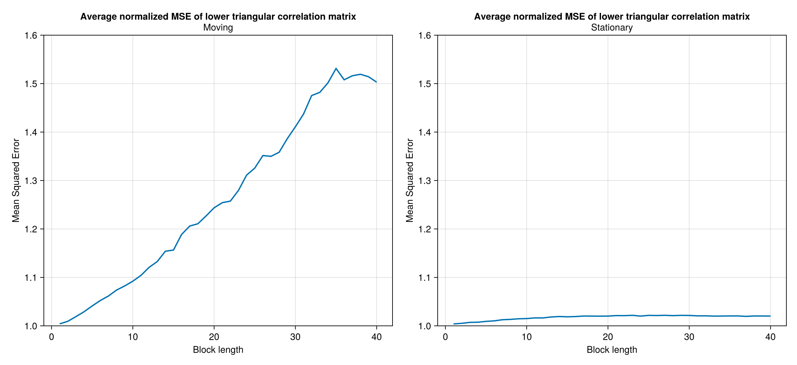

# Block Bootstrap Simulation Exercise

## Introduction 

We present an ad-hoc simulation study for the variables used in the macroeconomic models at DIE-BG. 
In our quest to assess the macroeconomic models in a robust manner, we aim to generate pseudo-test data using block bootstrap methods. This data can then be used to mimic fresh evaluation data to perform pseudo out-of-sample forecasting. 
The purpose of the simulation study presented here is to find suitable block lengths for the stationary and moving block bootstrap methods. 

The outline of the document is as follows. First, we present a brief introduction to the block bootstrap methods. Then, we describe a basic simulation exercise to perform using the bootstrap methods. Following, we report the results of the basic simulation exercise applied to relevant statistics of the data. We later compile and summarize those results in a unified metric to obtain insights about an ideal block length parameter for the bootstrap methods. Lastly, we compare our results with those from an optimal block length methodology available in the literature.

## Bootstraping methods for dependent data
In the literature, we can find different methods for dependent data. 
Some of them are regarded as "first generation methods," and take as basis fixed-length blocks or variable-length blocks. 
Blocks are resampled in an independent manner until forming a replication of the time series (usually of the same length as the original sample).

### Moving Block Bootstrap (MBB)
We start from a given sample $X_n \equiv \{X_1,...,X_n\}$ of size $n$. Then, we define a block of length $l$, with $l$ being a number that satisfies $1\leq l \leq n$. Once we have defined the block length we form different blocks of length $l$ contained in $X_n$ as follows.

$$\begin{aligned}
B_{1} & =\left(X_{1},X_{2},...,X_{l}\right)\\
B_{2} & =\left(X_{2},X_{3},...,X_{l+1}\right)\\
\vdots & =\vdots\\
B_{N} & =\left(X_{n-l+1},...,X_{n}\right)
\end{aligned}$$

where $N = n-l+1$ denotes the number of total blocks of length $l$ that will be formed and on which the bootstrap will be applied. Allowing the overlapping of the blocks in each iteration until the original sample length is reached. After the n bootstrap observations are formed, we proceed to estimate the statistic of interest (mean, variance, autocorrelation function or some other).

### Stationary Block Bootstrap (SBB)
As Moving Block Bootstrap we have a sample of $N$ observations of which we assume that they are stationary and time dependent. This method has the property of producing stationary pseudo time series.

The SBB method shares with the MBB the characteristic of working with blocks of time series that when joined together generate a “single block” of length $N$ as that of the original sample. The difference between SBB and MBB is that the block length in SBB changes at each iteration and in MBB the length is fixed. The algorithm as follows:

Let $X_1^*$ be an observation drawn at random from the original $N$ observations. $X_1^*$ is the first observation of the first block, so $X_1^*$ is defined as $X_1^* = X_{I_1}$. The next one has probability $p$ of being randomly drawn from the original $N$ observations and probability $1-p$ of being $X_2^* = X_{I_1+1}$ which be the next one in the original sample. The process ends when the $X_j^*$ is to be drawn at random from the original $N$ observations, this being the first observation of the next block. The iteration ends when we have a number of blocks that being joined together formed a "single block" of length $N$. So, the average length of the blocks is $\frac{1}{p}$.

## Basic simulation exercise
In our exercise, the objetive is to sample pseudo datasets using bootstrapping methods on the time series used for building macroeconomic models. The pseudo time series must adequately replicate some statistical properties of the original series. 

The time series considered are year-on-year rates of change, in quarterly frequency, of the following variables:

1. Real GDP of the US (D4L_GDP_RW)
2. PCE core inflation (D4L_CPI_RW)
3. Effective Federal Funds Rate (RS_RW)
4. Domestic real GDP (D4L_GDP)
5. Total domestic inflation (D4L_CPI)
6. Domestic core inflation (D4L_CPIXFE)
7. Exchange rate (GTQ/USD) (D4L_S)
8. Monetary base (D4L_MB)
9. Monetary policy rate (RS)

In order to generate robust results in this exercise, we generated 10,000 pseudo time series across a window of possible block lengths. To check the correct replication of the statistical properties, we computed important statistics for our purposes. These are:

1. The sample mean of each of the time series.
2. The variance of each of the time series.
3. The autocorrelation fuction up to 12 lags (or 3 years in quarterly frequency).
4. The correlation matrix between covariates.

For each bootstrap replication (pseudo time series for a given block length), we compute the above statistics and compare them to the statistics obtained from the actual sample. The idea is to compare the error that a given boostrap method (and its corresponding parametrization) gives in replicating the statistical properties of each time series. 

The Mean Squared Error (MSE) measures the error for one series and probably the error in all series if we decide to average all series. However, we consider it is not the best way to measure the error if we have statistics with different scales.

$\text{MSE}\left(\hat{\theta}_{i}^{m}\right) =\frac{1}{B}\sum_{b=1}^{B}\left( \hat{\theta}_{i}^{m,(b)} - \theta_{i} \right)^2$

As we want to generate a measure that combines an overall error in all statistics, we implemented a normalized MSE, which transforms the MSE by the standard deviation of the estimator in all replications. 
This modification allows us aggregating the error for statistics of different scales. 
So, we calculate a normalized mean square error to measure the error between the sample statistic and the original sample statistic, in relation to the variance of the sample statistic under a given bootsrap method. The normalized MSE is defined as follows:

$\text{nMSE}\left(\hat{\theta}_{i}^{m}\right)=\frac{1}{B}\sum_{b=1}^{B}\left[\frac{\hat{\theta}_{i}^{m,(b)}-\theta_{i}}{\text{sd}\left(\hat{\theta}_{i}^{m}\right)}\right]^{2}$

where:
- l $i$ is the number of bootstrap replication. 
- $B$ is the total number of replications, i.e., 10,000.
- $\hat{\theta}_{i}^{m}$ is the statistic for covariate $i$ under block bootstrap method $m$ with length $l$. Superindex $(b)$ denotes the $b$-th bootstrap replication.
- $\theta_{i}$ is the statistic for covariate $i$ observed in the full sample.
- $\hat\sigma_{i}^{m}$ is the standard deviation of the distribution of resampled statistics for covariate $i$ under block bootstrap method $m$. 

The normalized MSE takes values around one for any statistic $\theta_i$, so it is very convenient to combine them to obtain a single metric that captures the error for each of the covariates and desired statistics. 
Finally, we will compare the overall performance between bootstrap methods by averaging the evaluation metric between covariates, as follows: 

$\text{nMSE}\left(\hat\theta^m\right) = \frac{1}{K} \sum_{k=1}^{K} \text{nMSE}\left(\hat\theta_{k}^{m}\right)$

## Results for the sample mean

The exercise compares the performance of two methods: the moving (MBB) and the stationary block bootstrap (SBB) in replicating the sample mean for all possible block lengths which, given our sample size (91 observations) $l$ should be a number that satisfies $1\leq l \leq 91$. For each $l$ we generate $B=10,000$ pseudo time series with the moving and stationary methods, respectively, and estimate the mean for each of them. Then, we compare their sample distribution of means to the historical sample mean. 

The first plot shows the average of the original MSE of all series and the second one the modified MSE. We note that in both cases the best method is the Stationary. 
However, for the normalized MSE and for all possible block lengths, the mean estimator obtained by SBB is consistently close to one, which means that the estimator has low bias for every block length $l$ considered. 
Note the mean estimator of the MBB starts close to one for small block lengths, it consistently deviates from one as the block length gets larger.

As we said before, we prefer the normalized MSE metric since it allows us to average the error among covariates and aggregate across various statistics of interest.

## Results for the sample variance

For the sample variance of the covariates, we follow a similar procedure for comparing between block bootstrap methods as the one used for the sample mean. 

Let us note how the MSE behavior of the sample variance estimator in the MMB method is more volatile than the SBB method. This is true for the unnormalized MSE as well as for the normalized MSE. In both cases we prefer the SBB method as the most apropiate method to replicate the sample variance. But the analysis is incomplete, we need the results of norrmalized MSE of mean, autocorrelation fuction and covariance matrix to determinate the best method to replicate the estistics of interest.

## Results of the sample autocorrelation function
For the autocorrelation fuction analysis we have an additional dimention, the lags of the variable itsel, to determinate the error with respect to the sample autocorrelation fuction. In our excercise we consider 12 lags to generate the sample autocorrelation function estimator. In particular we have an arrage of dimension $13 \times 10 \times 40 \times 10000$:

- 12 lags plus lag 0
- 10 variables
- 40 possible block lengths
- 10,000 pseudo time series (block bootstrap series)

We mesure the MSE for all possible block lengths in the same way that mean an variance analysis, but the difference is we have an additional dimention. To measure the MSE we calculate a weighted average over the lags. All weights decay exponentially.

For both MBB and SBB and also for its normalized version of MSE, the error decays significantly in the first 10 possible block lengths. This property is very important because it tells us about a continuously decaying error for the SBB and a minimum error in the MBB method as we can see in the graphs. To complete the analysis, we will show the results of the last statistic of interest, namely the covariance matrix.

## Results of the sample covariance matrix
In the same way as the autocorrelation function, the covariance matrix adds an additional dimension to the analysis to determine the error with respect to the sample covariance matrix. For de covariance matrix we measured the MSE with the lower triangular elements.

The normalized MSE shows the same behavior for the MBB and SBB methods, with slightly more volatility for the SBB method. Like in others statistics the SBB method exhibits the best results with consistently smaller MSE than the MBB method.

Consistently with others statistics the SBB method is the best to replicate the sample covariance matrix characteristics.
<!-- Use the folder images/simulation_study for the images of the presentation -->

## Unified metric for comparing block bootstrap metrics

As we have four different main statistics that we are concerned the bootstrap samples replicate from the dataset, we propose comparing block bootstrap methods (and possibly other resampling methodologies) by an aggregation of the normalized MSEs for the mean, the variance, and the entries of the autocorrelation function and the correlation matrix between covariates.

Hereafter, let $i$ index a variable and $m$ a block bootstrap method. Let $\hat\mu_{i}^{m}$ the sample mean estimator. We form the mean component of the unified metric by averaging over covariates:

$\text{nMSE}\left(\hat{\mu}^{m}\right)=\frac{1}{K}\sum_{k=1}^{K}\text{nMSE}\left(\hat{\mu}_{k}^{m}\right)$

Similarly, for the sample variance estimator, $\hat{\sigma^2}_{i}^{m}$, we form the variance component of the unified metric by averaging over covariates: 

$\text{nMSE}\left(\hat{\sigma^{2}}^{m}\right)=\frac{1}{K}\sum_{k=1}^{K}\text{nMSE}\left(\hat{\sigma^{2}}_{k}^{m}\right)$

Now, for the autocorrelation function we are evaluating its closeness to the one computed on the whole sample using up to 12 lags. 
Let $\hat\gamma_{i,l}^{m}$ the $l$-th entry of the sample autocorrelation function, where $l=1,\ldots,12$. (Note $\hat\gamma_{i,0}^{m}=1$ always.)  
We again combine the MSE for each of the entries of the autocorrelation function using a decaying exponential weighted average as follows: 

$\text{nMSE}\left(\hat{\gamma}_{i}^{m}\right)=\frac{1}{\bar{\alpha}}\sum_{l=1}^{12}\alpha^{i-1}\text{nMSE}\left(\hat{\gamma}_{i,l}^{m}\right)$

where, of course, $\bar{\alpha}=\sum_{l=1}^{12}\alpha^{i-1}$. We use $\alpha=0.9$. 
Then, the autocorrelation component of the unified metric is computed by averaging over covariates: 

$\text{nMSE}\left(\hat{\gamma}^{m}\right)=\frac{1}{K}\sum_{k=1}^{K}\text{nMSE}\left(\hat{\gamma}_{k}^{m}\right)$

Finally, for the correlation between covariates, we follow a similar approach as for the autocorrelation. We average over the normalized MSEs of the sample correlation statistics below the main diagonal of the correlation matrix. 

Let $\hat\rho_{i,j}^{m}$ be the samle correlation between covariates $i$ and $j$ under block bootstrap method $m$. We compute the correlation component of the unified metric by averaging over entries of the lower triangular part of the correlation matrix: 

$\text{nMSE}\left(\hat{\rho}^{m}\right)=\frac{2}{K\left(K-1\right)}\sum_{i=1}^{K}\sum_{j<i}\text{nMSE}\left(\hat{\rho}_{i,j}^{m}\right)$

In sum, the unified metric for bootstrap method $m$, $\text{unMSE}\left(m\right)$, is defined as the sum of four components: 

$\text{unMSE}\left(m\right)=\text{nMSE}\left(\hat{\mu}^{m}\right)+\text{nMSE}\left(\hat{\sigma^{2}}^{m}\right)+\text{nMSE}\left(\hat{\gamma}^{m}\right)+\text{nMSE}\left(\hat{\rho}^{m}\right)$ 

In the following figure, we plot the four components of the unified metric as a function of the block length: 

We can see that the autocorrelation dominates the normalized error decomposition because the bias is too high for small block lengths. 
In the following figure, we show the behavior of the other three components: 

Then, we compute the sum of the four components to get the unified metric. This is shown in the figure below. 
As we can see, the total error decays quickly with the block length for both block methods.
This rapid decrease suggests that the block length for resampling the whole dataset (with 91 observations) is not necessarily too big to approximate well the four components we care about with the unified metric.  
The MBB exhibits a minimum at $l=19$. 
Althought the SBB does not exhibit a minimum value, we find that 95% of the total decrease in the error occurs at a block length $l=10$. This result is, of course, contingent on the maximum block length explored for the resampling, which is $40$ for the figure below. However, we re-run the experiment with a maximum block length of $90$ (almost the number of observations in the dataset) and find that the 95% decrease in the total error occurs at the block length $l=11$. 

## Optimal block size from the literature

We compare our insights about the block length with the methodology of  Patton, Politis y White (2009)[^PPW2009] (hereafter, PPW).
They derive a procedure for obtaining the optimal block length for a time series using spectral methods. 
This procedure is available in the Julia library `DependentBootstrap.jl`. 
We apply this procedure to the same individual time series from our dataset. 

The optimal block size estimator in the paper uses a criterion based on minimizing the asymptotic mean squared error of the stationary bootstrap variance estimator. 
In the end, their approach relies on estimating the autocovariance structure of the data and selecting a block length that balances capturing dependence and maintaining bootstrap efficiency.

### Politis and White's (2004) Proposal for the Optimal Block Size

We present an introduction of Politis and White's (2004)[^PW2004] methodology for estimating the optimal (expected) block size of the stationary bootstrap. From a theorem in Lahiri (1999),[^Lahiri1999] Politis and White (2004) derive: 

$\text{MSE}\left(\hat{\sigma}_{b,SB}^{2}\right)=\frac{G^{2}}{b^{2}}+D_{SB}\frac{b}{N}+o\left(b^{-2}\right)+o\left(b/N\right),$ 

so, the large-sample $\text{MSE}\left(\hat{\sigma}_{b,SB}^{2}\right)$ is minimized when choosing 

$b_{opt,SB}=\left(\frac{2G^{2}}{D_{SB}}\right)^{1/3}N^{1/3}.$ 

In the above equations, the sample size is $N$, and the quantities $D_{SB}$ and $G$ depend on the autocovariance function, $R\left(k\right)$, and the power spectral density function, $g(w)$, of the time series: 

$\begin{aligned}
D_{SB} & =2g^{2}\left(0\right) \\ 
G &=\sum_{k=-\infty}^{\infty}|k|R\left(k\right). \\
\end{aligned}$ 

Next, Politis and White (2004)[^PW2004] use the "flat-top" lag-window of Politis and Romano (1995)[^PR1995] to estimate the infinite sums involved in the calculation of $G$ and $g(w)$. So, they provide a final estimator for the optimal block size: 

$\begin{aligned}
\hat{g}\left(w\right) & =\sum_{k=-M}^{M}\lambda\left(k/M\right)\hat{R}\left(k\right)\cos\left(wk\right), \\
\hat{G}	& =\sum_{k=-M}^{M}\lambda\left(k/M\right)|k|\hat{R}\left(k\right), \\
\hat{D}_{SB} & =2\hat{g}^{2}\left(0\right) \\
\end{aligned}$

In the above, $\hat{R}$ is the sample autocovariance function, $\lambda\left(\cdot\right)$ is the flat-top trapezoidal window function. The expressions depend also on the parameter $M$, which Politis and White (2004) recommend choosing by inspection of the correlogram.[^M]

The expressions above for $D_{SB}$ were corrected by Patton, Politis and White (2009), since Nordman (2008)[^Nordman2008] discovered an error in Lahiri's (1999) calculation of the variance associated with the stationary bootstrap. The final expression above for $D_{SB}$ is much simpler than the original (erroneous) expression from Politis and White (2004). 

[^PPW2009]: Patton, A., Politis, D. N., & White, H. (2009). Correction to “Automatic block-length selection for the dependent bootstrap” by D. Politis and H. White. Econometric Reviews, 28(4), 372-375.

[^M]: In particular, Politis and Romano (1995) suggest looking for the smallest integer, say $\hat{m}$, after which the correlogram appears negligible, i.e., $\hat{R}(k) \approx 0$ for $k>\hat{m}$. After identifying this value on the correlogram, the recomendation is to take $M=2\hat{m}$. 

[^PW2004]: Politis, D. N., White, H. (2004). Automatic block-length selection for the dependent bootstrap. Econometric Reviews 23(1):53–70

[^PR1995]: Politis, D. N., Romano, J. P. (1995). Bias-corrected nonparametric spectral estimation. J. Time Series Anal. 16:67–103.

[^Lahiri1999]: Lahiri, S. N. (1999). Theoretical comparisons of block bootstrap methods. Annals of Statistics 27:386–404

[^Nordman2008]: Nordman, D. J. (2008). A note on the stationary bootstrap's variance. Annals of Statistics

### Results

The following figure shows the results of applying PPW to each of the time series in our dataset. We can see that most series require a block length of less than 10. However, time series like core inflation (D4L\_CPIXFE) and the year-on-year change of the exchange rate (D4L\_S) require a higher block length, as they are more persistent, and thus, their correlogram functions decay slower.
The figure also shows the average and the median block length. 
The Julia library computes the median by default to combine the different block lengths for a dataset. Unfortunately, we could not found any formal criteria to choose the block length for a multivariate dataset.  

## Concluding remarks

<!-- to-do -->

## Appendix: Normalized MSE interpretation 

In the bootstrap world, let $\theta$ be an observed statistic and $\hat{\theta}$ be an estimator of such quantity.
We can compute the standard deviation of the bootstrap sample distribution of $\hat{\theta}$, $\text{sd}\left(\hat\theta\right)$, to normalize the mean squared error. 
Expanding this normalized MSE formula, we obtain: 

$$\begin{aligned}
\text{nMSE}\left(\hat{\theta}\right) & =\frac{1}{B}\sum_{b=1}^{B}\left[\frac{\hat{\theta}^{(b)}-\theta}{\text{sd}\left(\hat{\theta}\right)}\right]^{2}\\
 & =\frac{1}{\text{Var}\left(\hat{\theta}\right)}\cdot\frac{1}{B}\sum_{b=1}^{B}\left(\hat{\theta}^{(b)}-\theta\right)^{2}\\
 & =\frac{1}{\text{Var}\left(\hat{\theta}\right)}\cdot\text{MSE}\left(\hat{\theta}\right)\\
 & =\frac{1}{\text{Var}\left(\hat{\theta}\right)}\cdot\left[\text{Var}\left(\hat{\theta}\right)+\text{Bias}\left(\hat{\theta}\right)^{2}\right]\\
 & =1+\frac{\text{Bias}\left(\hat{\theta}\right)^{2}}{\text{Var}\left(\hat{\theta}\right)}
\end{aligned}$$

Thus, this measure is one (unitless) for unbiased estimators. In contrast, if the bias of the estimator is small, the $\text{nMSE}$ will be close to one. 