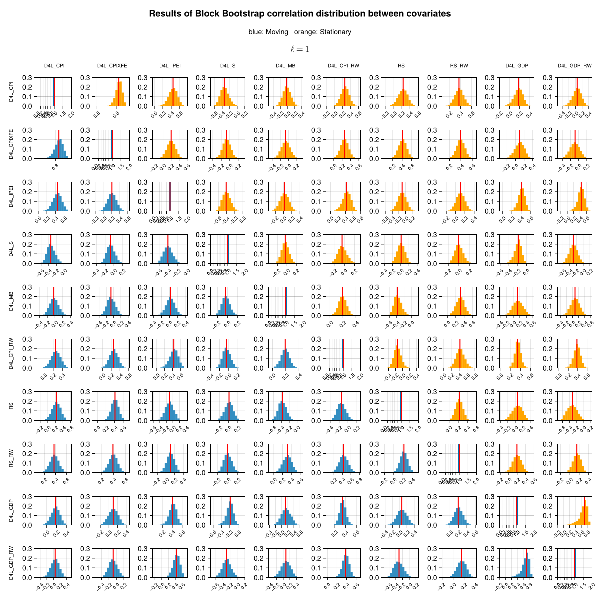
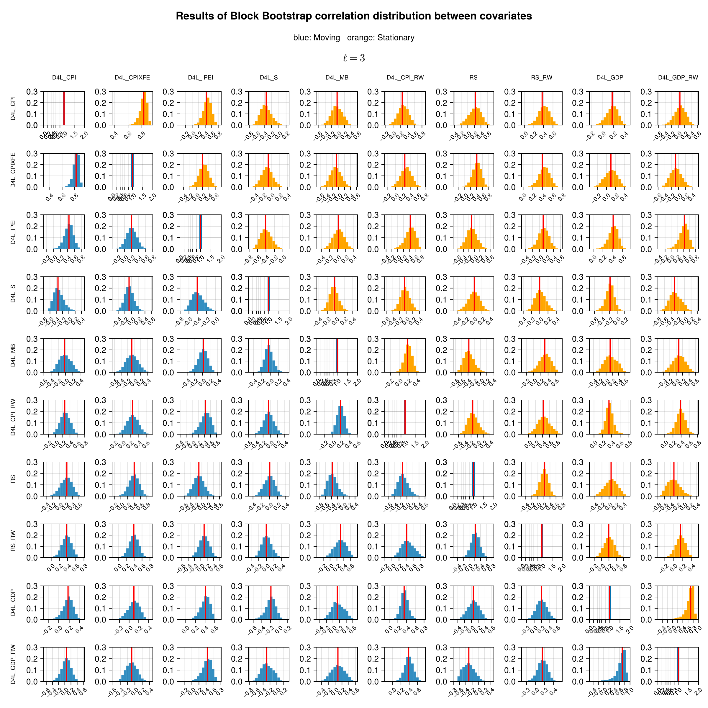
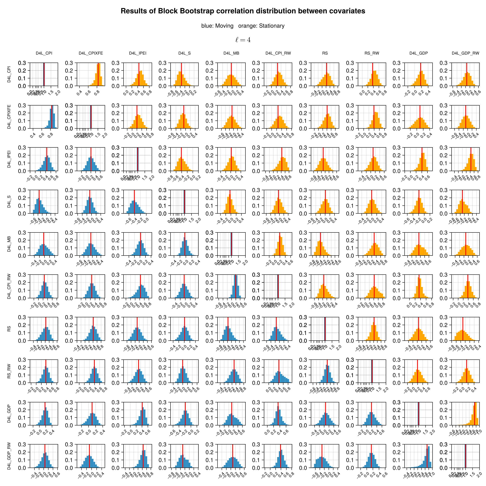
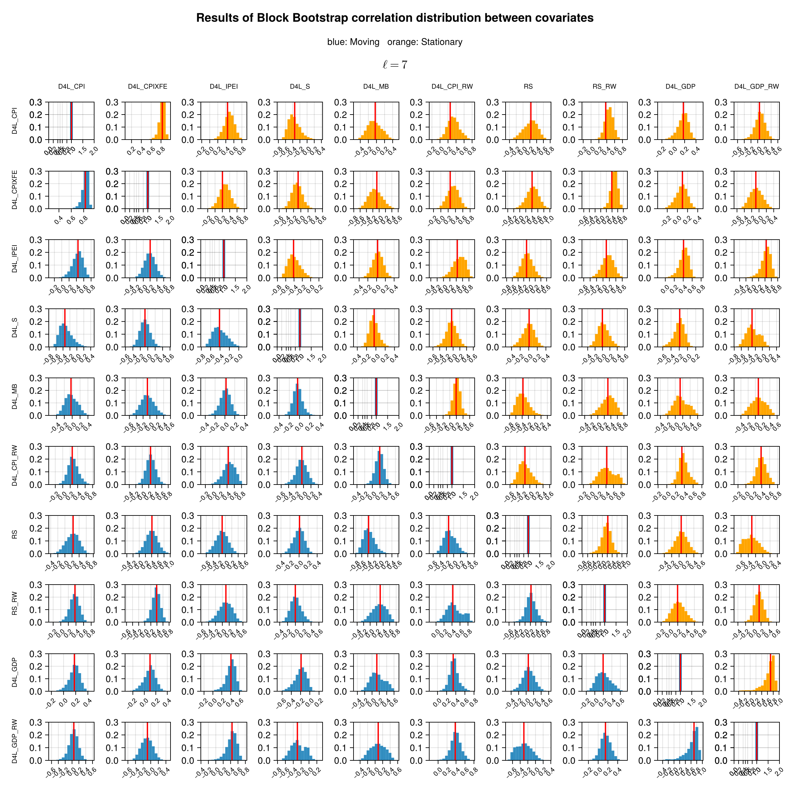
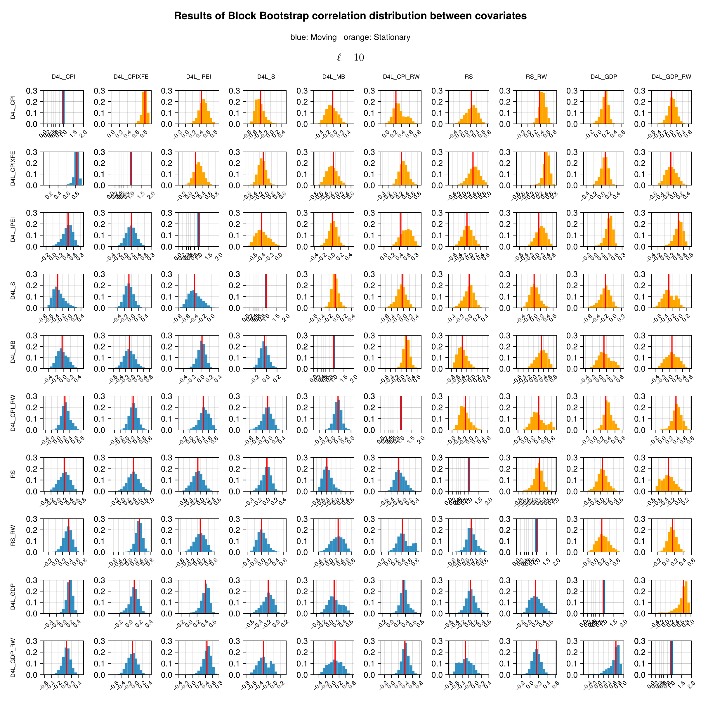
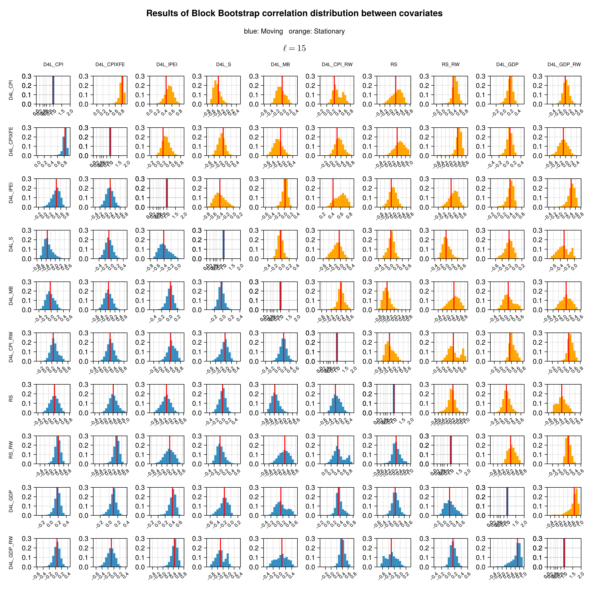
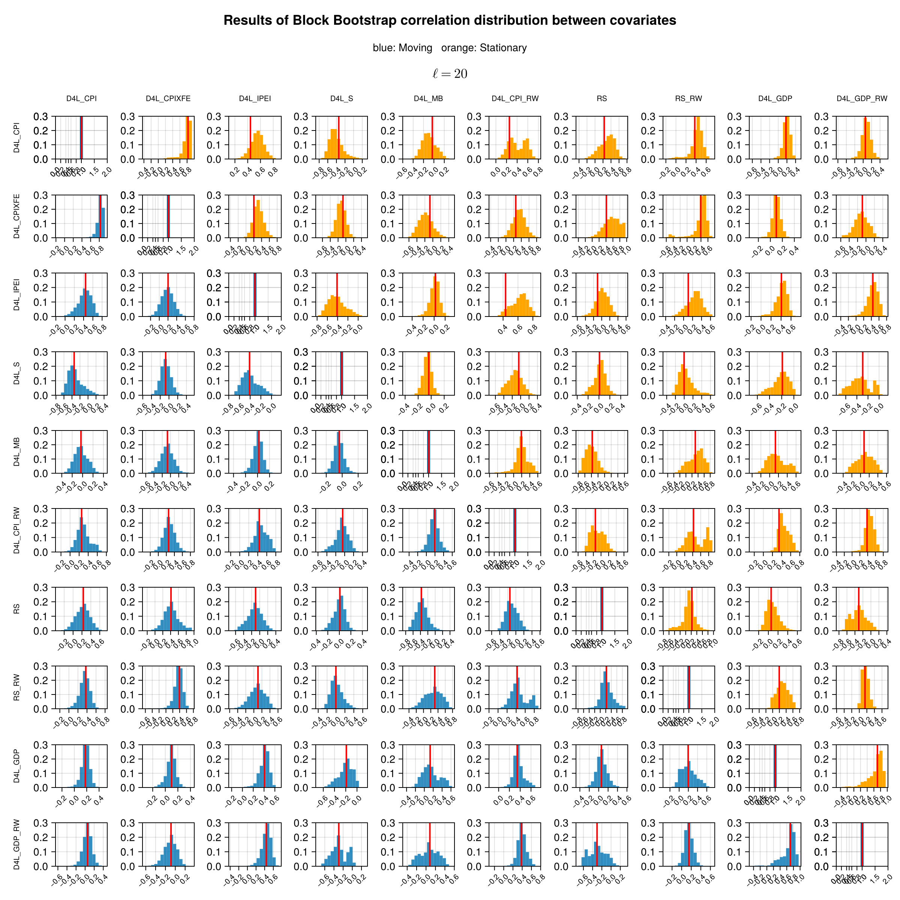
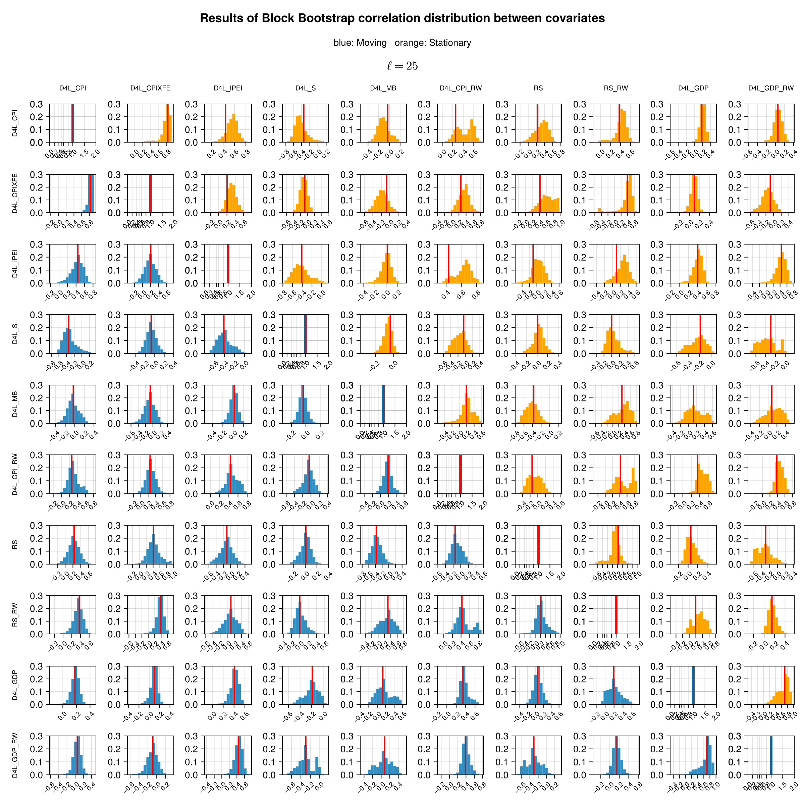
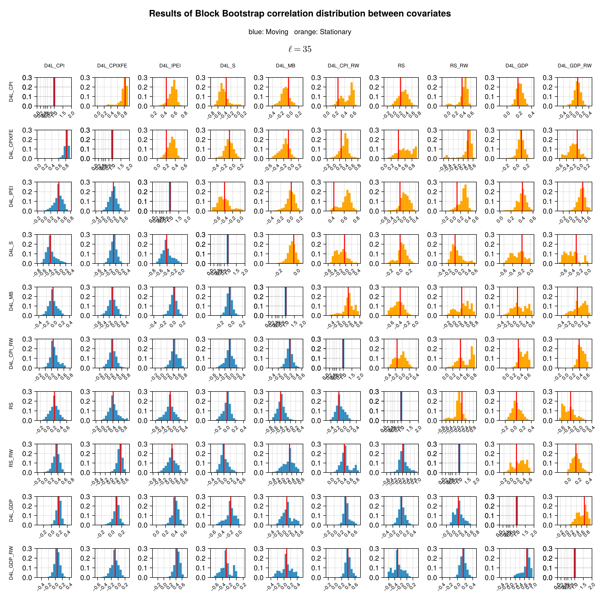
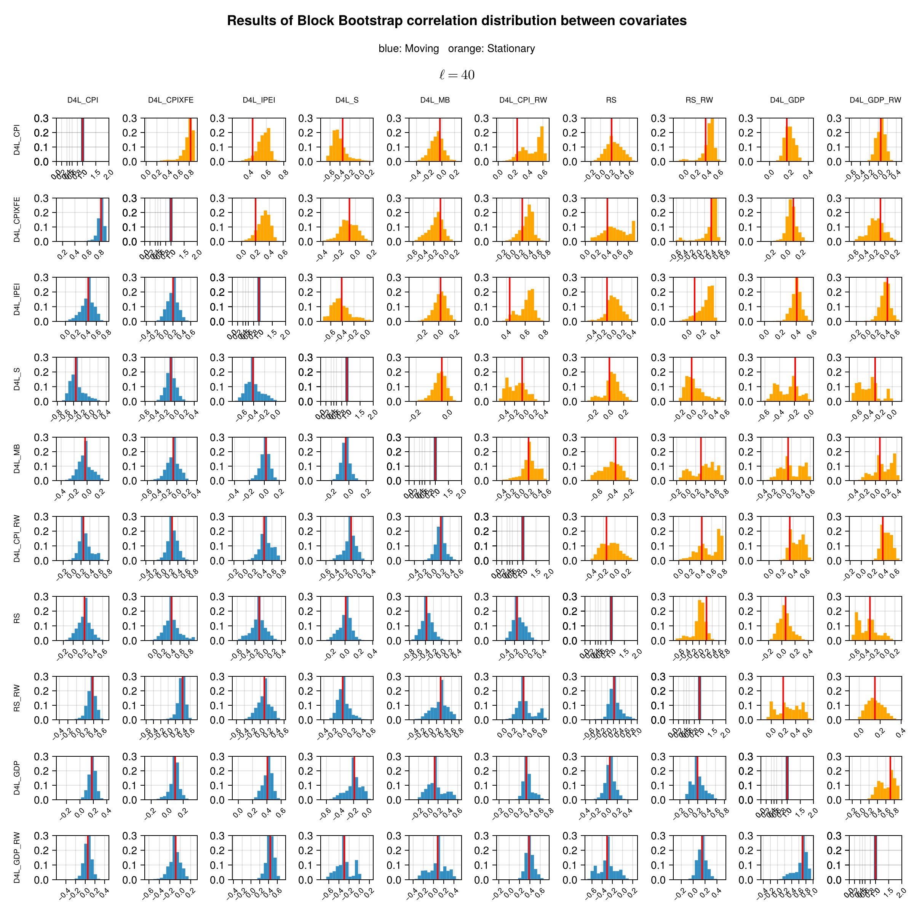

# Correlation Analysis

## Correlation between covariates for Moving and Stationary Block Bootstrap
We show the distribution of the correlation coefficient for all variables and given block lengths. 
The moving block bootstrap is shown in blue and the stationary in orange. 
Note that the correlation distribution is very similar for both the MBB and SBB methods in the first four blocks, and the difference is more evident as the block length increases. 
This is consistent with the normalized MSE which becomes significantly different for both methods starting from the block lengths greater than 4.

### Length = 1

### Length = 3

### Length = 4

### Length = 7

### Length = 10

### Length = 15

### Length = 20

### Length = 25

### Length = 35

### Length = 40
