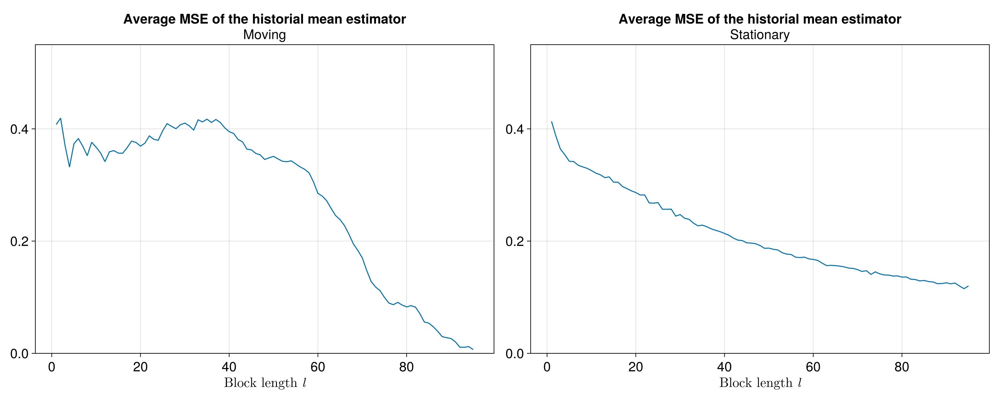
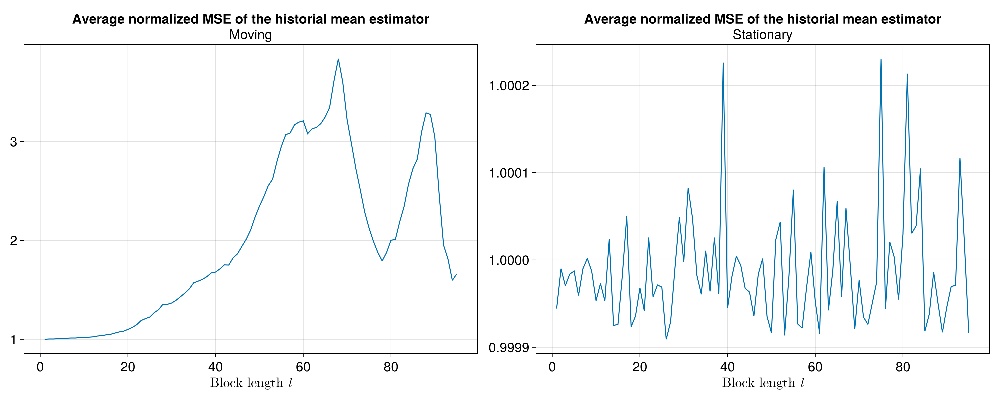
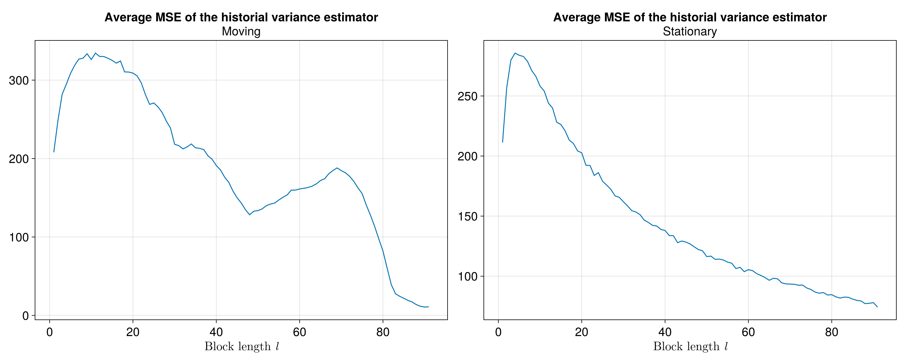
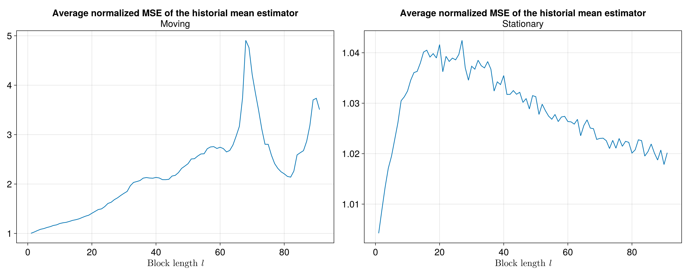
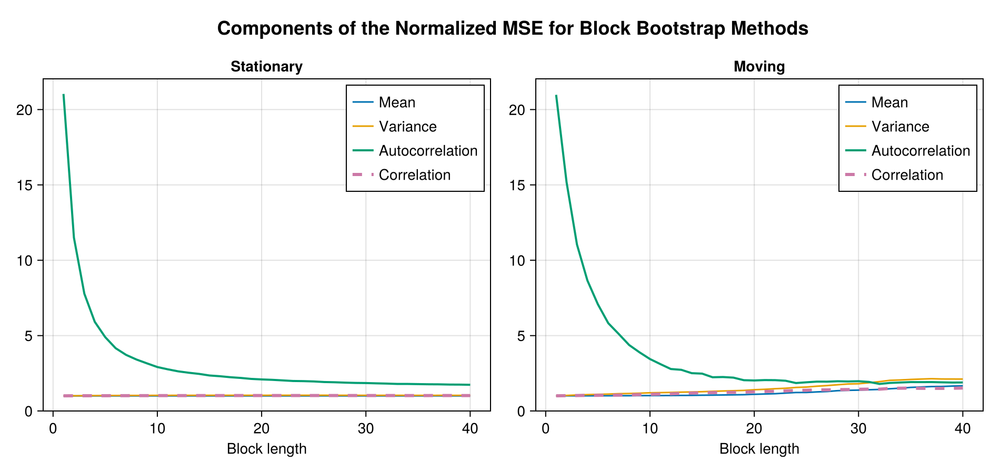

# Block Bootstrap Simulation Exercise with DLAs

In the same line of Simulation Study section, we present some of main results 
of Block Bootstrap Simulation Exercise 
using 11 variables. In this case, most of the time series are annualized
quarterly-on-quarterly rates of change, in quarterly frequency.

## Variables quarterly-on-quarterly change

The time series considered are the following variables:

1. Real GDP of the US (DLA\_GDP\_RW)
2. PCE core inflation (DLA\_CPI\_RW)
3. Effective Federal Funds Rate (RS\_RW)
4. Domestic real GDP (DLA\_GDP)
5. Total domestic inflation (DLA\_CPI)
6. Domestic core inflation (DLA\_CPIXFE)
7. Exchange rate (GTQ/USD) (DLA\_S)
8. Monetary base (DLA\_MB)
9. Monetary policy rate (RS)
10. Import prices (DLA\_IPEI)
11. Remmitances (GTQ) over nominal GDP (REM\_GDP)

In order to generate robust results in this exercise, we generated $B=10000$ bootstrap 
replications of the dataset. The time series are resampled using a range of possible block lengths. 
To check the correct replication of the statistical properties, we computed important statistics for our purposes. These are:

1. The sample mean of each of the time series.
2. The variance of each of the time series.
3. The autocorrelation fuction up to 12 lags (or 3 years in quarterly frequency).
4. The correlation matrix between covariates.

For each bootstrap replication (pseudo time series for a given block length), 
we compute the above statistics and compare them to the statistics obtained from the actual sample. 
The idea is to compare the error that a given boostrap method (and its corresponding parametrization) 
gives in replicating the statistical properties of each time series. 

We use a Mean Squared Error (MSE) loss function to measure the 
deviations of the bootstrap methods in producing the observed statistics. 
The formula for the MSE of the statistic $\hat{\theta}_{i}^{m}$ of 
variable $i$ is given as follows: 

## Results for the sample mean

The exercise compares the performance of two methods: the moving (MBB) and the stationary block bootstrap (SBB) in replicating the sample mean for all possible block lengths $l$. 
Given our sample size (91 observations) $l$ should be a number that satisfies $1\leq l \leq 91$. 
For each $l$ we generate $B=10,000$ pseudo time series with the moving and stationary methods, respectively, and compute the sample mean for each of them. Then, we compare their sample distribution to the historical sample mean. 

The first plot shows the average of the original MSE of all series and the second one the modified MSE. We note that in both cases the best method is the stationary. 
However, for the normalized MSE and for all possible block lengths, the mean estimator obtained by the SBB is consistently closer to one, which means that the estimator has low bias for every block length $l$ considered. 
Notably, the mean estimator of the MBB starts close to one for small block lengths but it consistently deviates from one as the block length gets larger.

As stated before, we rely on the normalized MSE metric for our analysis, since it allows us to average the error among covariates and aggregate across various statistics of interest.

## Results for the sample variance

For the sample variance of each of the covariates, we follow a similar procedure for comparing between block bootstrap methods as the one used for the sample mean. 

Let us note how the MSE behavior of the sample variance estimator with the MMB method is more volatile than that with the SBB method. This is true for the unnormalized MSE as well as for the normalized MSE. In both cases we prefer the SBB method as the most apropiate method to replicate the sample variance for most block lengths. However, the analysis is still incomplete, as we need to takie into account the sample autocorrelation of each of the covariates and the correlation matrix to determine the best method to replicate the statistics of interest.

## Results of the sample autocorrelation function
For the autocorrelation fuction analysis we have an additional dimension (i.e. the lags of the autocorrelation function entries) to determine the error with respect to the sample autocorrelation function. 
In our excercise we consider only 12 lags to generate the sample autocorrelation function. In particular we have an array of dimension $13 \times 10 \times 40 \times 10000$:

- 12 lags (plus lag 0).
- 10 variables
- 40 possible block lengths
- 10,000 pseudo time series (block bootstrap series)

We measure the MSE for all possible block lengths in the same way that in the mean an variance analyses, but the difference is that we have an additional dimension. 
To measure the overall MSE, we compute a weighted average over all lags. All weights decay exponentially.

For both the MBB and the SBB (and for their normalized version of the MSE), the error decays significantly in the first 10 possible block lengths. This property is very important because it tells us about a continuously decaying error for the SBB and a minimum error in the MBB method as we can see in the graphs. To complete the analysis, we will show the results of the last statistic of interest, namely the covariance matrix.

## Results of the sample correlation matrix
In the same way as the autocorrelation function, the correlation matrix between covariates adds an additional dimension to the analysis to determine the error with respect to the sample correlation matrix. For this analysis, we measured the MSE between the bootstrap samples and the historical estimates using only the lower triangular elements of the correlation matrix.

The normalized MSE shows the same behavior for the MBB and the SBB methods, with slightly more volatility for the SBB method. Like in others statistics, the SBB method exhibits the best results with consistently smaller MSE than the MBB method.

Consistent with others statistics, the SBB method is the best to replicate the sample covariance matrix characteristics for the different block lengths.

## Unified metric for comparing block bootstrap metrics

As we have four different main statistics that we are concerned the bootstrap samples replicate from the dataset, we propose comparing block bootstrap methods (and possibly other resampling methodologies) by an aggregation of the normalized MSEs for the mean, the variance, and the entries of the autocorrelation function and the correlation matrix between covariates.

In the following figure, we plot the four components of the unified metric as a function of the block length: 

We can see that the autocorrelation dominates the normalized error decomposition because the bias is too high for small block lengths. 
In the following figure, we show the behavior of the other three components: 

Then, we compute the sum of the four components to get the unified metric. This is shown in the figure below. 
As we can see, the total error decays quickly with the block length for both block methods.
This rapid decrease suggests that the block length for resampling the whole dataset (with 91 observations) is not necessarily too big to approximate well the four components we care about with the unified metric.  
The MBB exhibits a minimum at $l=19$. 
Althought the SBB does not exhibit a minimum value, we find that 95% of the total decrease in the error occurs at a block length $l=10$. This result is, of course, contingent on the maximum block length explored for the resampling, which is $40$ for the figure below. However, we re-run the experiment with a maximum block length of $90$ (almost the number of observations in the dataset) and find that the 95% decrease in the total error occurs at the block length $l=11$. 

## Concluding remarks

In this simulation study we presented a methodology to compare the performance of the moving and stationary block bootstrap methods in replicating the statistical properties of a dataset.
We used a unified metric to compare the performance of the two methods in replicating the sample mean, variance, autocorrelation function, and correlation matrix between covariates.
We found that the stationary block bootstrap method outperforms the moving block bootstrap method in all statistics of interest.
We also compared our results with the optimal block length methodology proposed by Patton, Politis, and White (2009) and found that the optimal block length is consistent with the results obtained from our simulation study.
Moreover, the methodology presented here can be used to determine the optimal block length for the block bootstrap method in a dataset of interest.
We leave for future work the extension of this methodology to other resampling methods, such as frequency domain bootstrap methods. 

