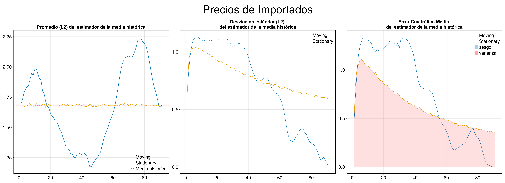
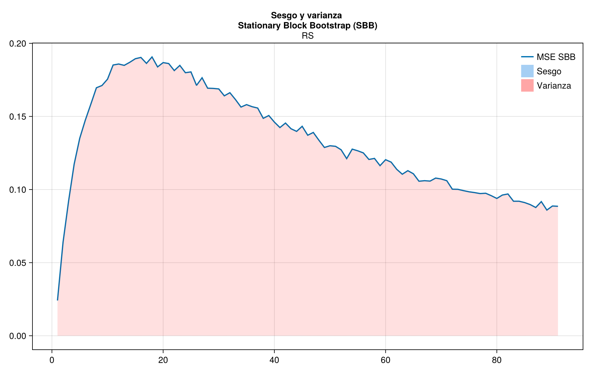

# Mean Analysis

## Means of Moving and Stationary Block Bootstrap

The first graph shows the estimator of the mean at each possible block size, the second the standardd deviation of 10000 simulations and the last the MSE of the mean estimator.

## Bias and variance of MSE of the mean estimator

Bias and variance decomposition for MSE of mean estimator.

