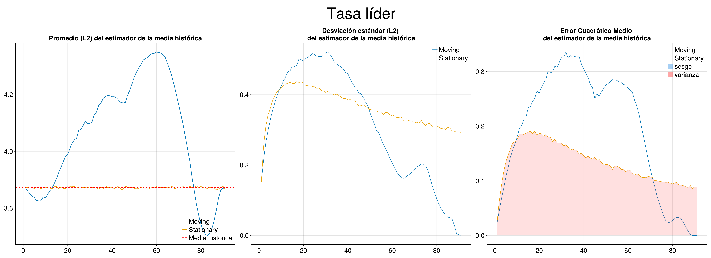

# Mean Analysis

## Means of Moving and Stationary Block Bootstrap

The first graph shows the estimator of the mean at each possible block size, the second shows the standard deviation of $B=10000$ bootstrap replications, and the last shows the MSE of the mean estimator.

## Total domestic inflation (D4L_CPI)

## Domestic core inflation (D4L_CPIXFE)

## Import Prices (D4L_IPEI)

## Exchange rate (GTQ/USD) (D4L_S)

## Monetary base (D4L_MB)

## PCE core inflation (D4L_CPI_RW)

## Monetary policy rate (RS)

## Effective Federal Funds Rate (RS_RW)

## Domestic real GDP (D4L_GDP)

## Real GDP of the US (D4L_GDP_RW)

## Bias and variance of MSE of the mean estimator

Bias and variance decomposition for MSE of mean estimator.

## Total domestic inflation bias and variance analysis

## Domestic core inflation bias and variance analysis

## Import Prices bias and variance analysis

## Exchange rate bias and variance analysis

## Monetary base bias and variance analysis

## PCE core inflation bias and variance analysis

## Monetary policy rate bias and variance analysis

## Effective Federal Funds Rate bias and variance analysis

## Domestic real GDP bias and variance analysis

## Real GDP of the US bias and variance analysis

