# Standar deviation analysis

## Standar deviation of Moving and Stationary Block Bootstrap
The first graph shows the estimator of the standar deviation at each possible block size, the second the standard deviation of 10000 simulations and the last the MSE of the standar deviation estimator.

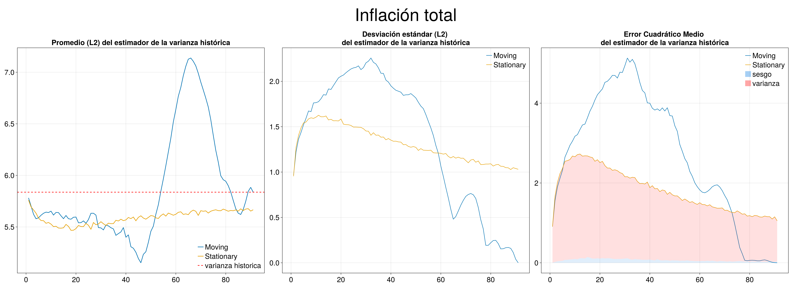
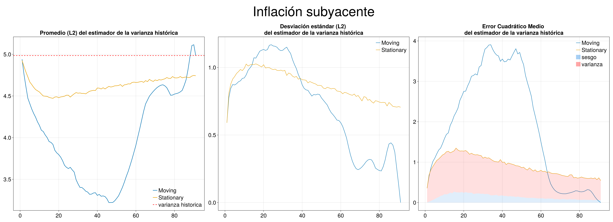
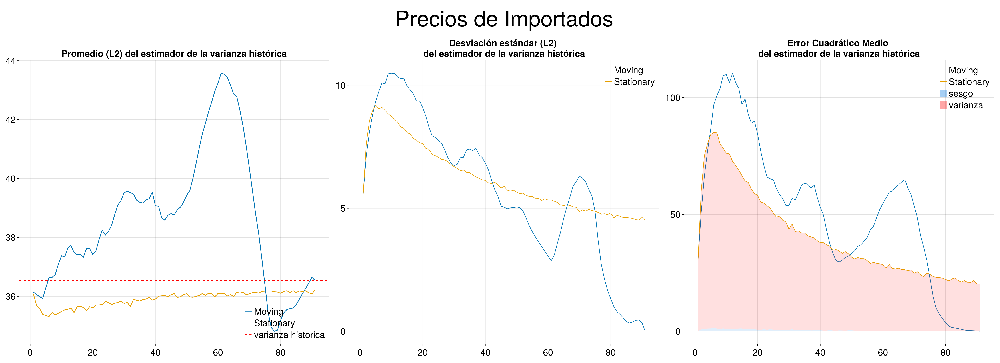
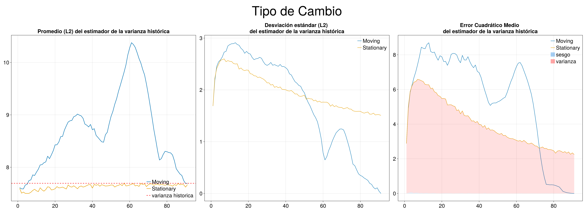
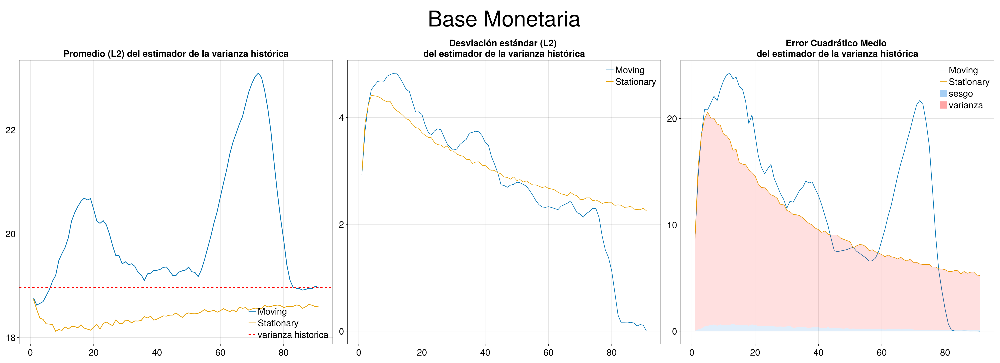
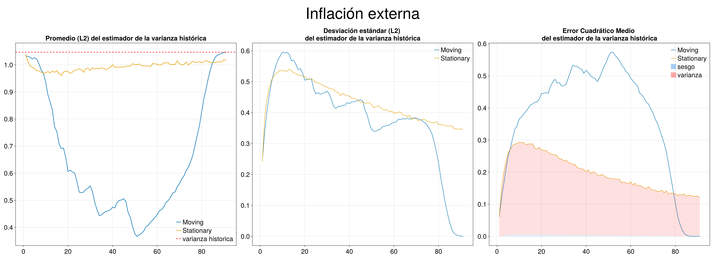
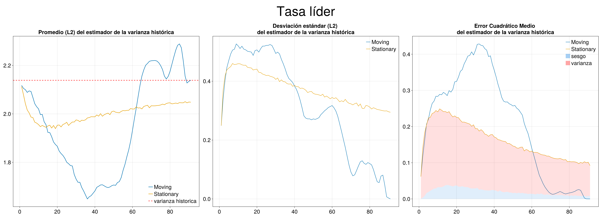
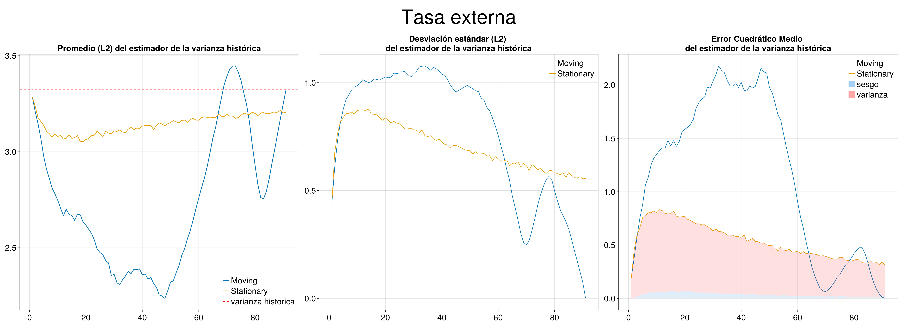
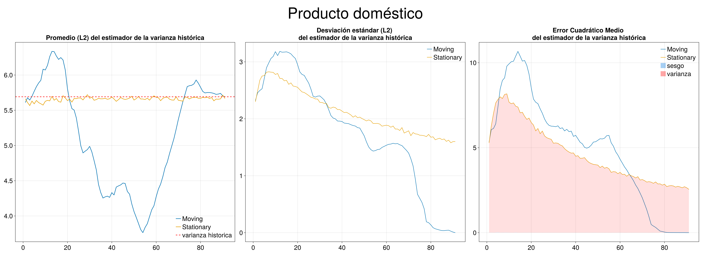

## Bias and variance of MSE of the standar deviation estimator

Bias and variance decomposition for MSE of standar deviation estimator.

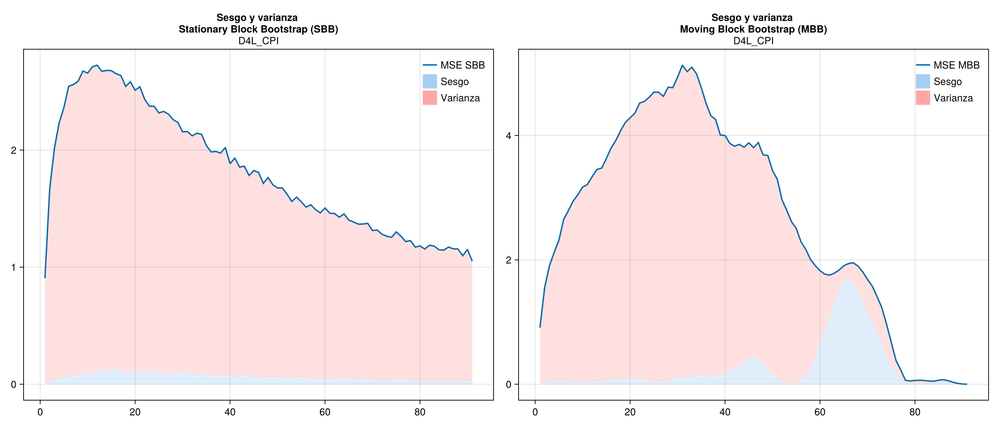
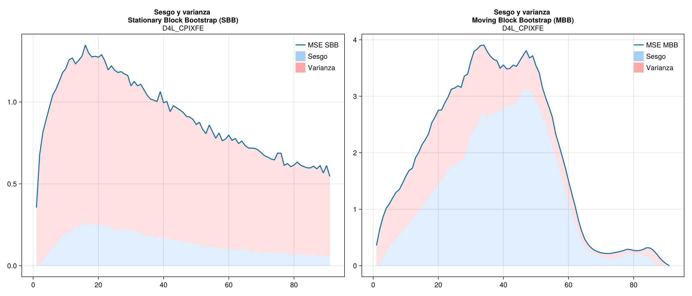
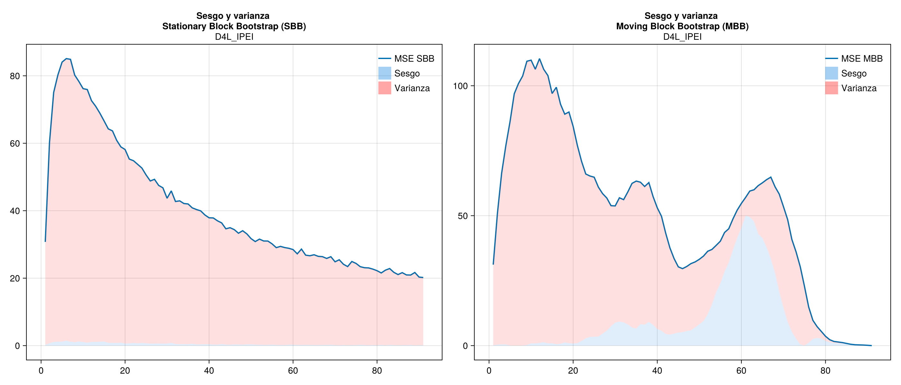
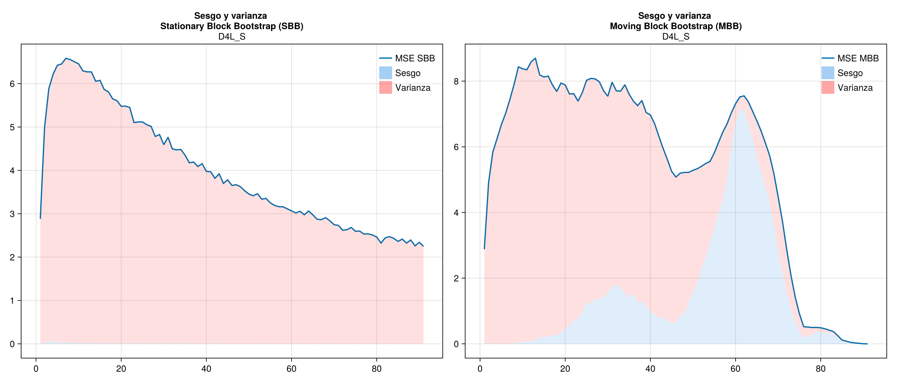

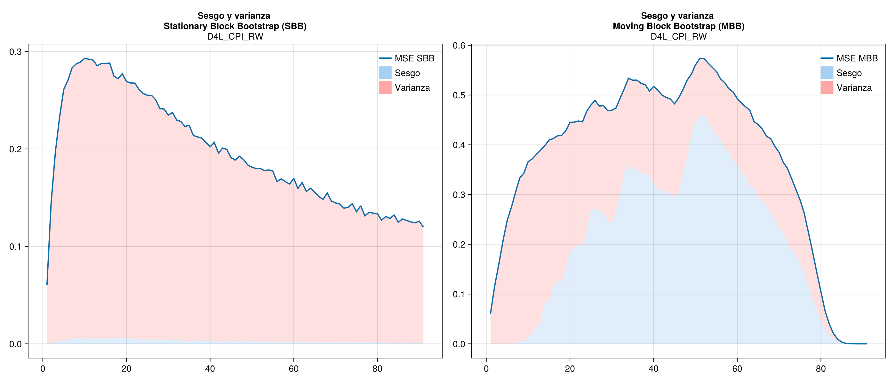
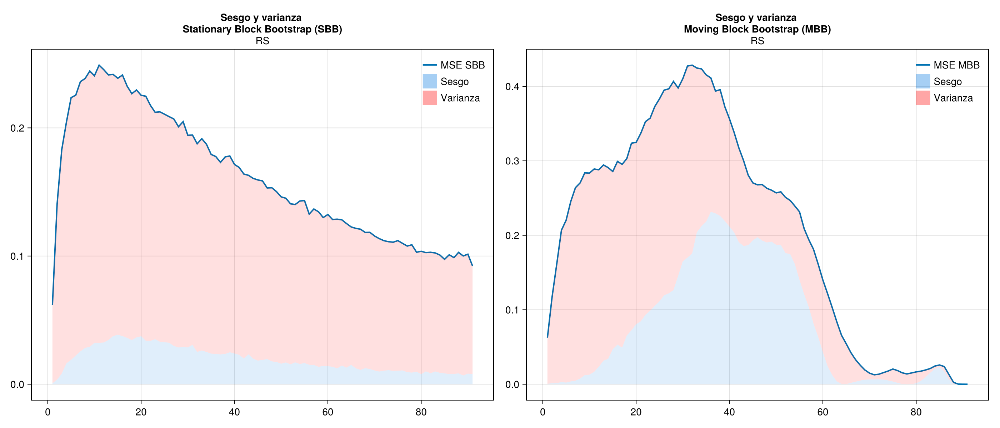
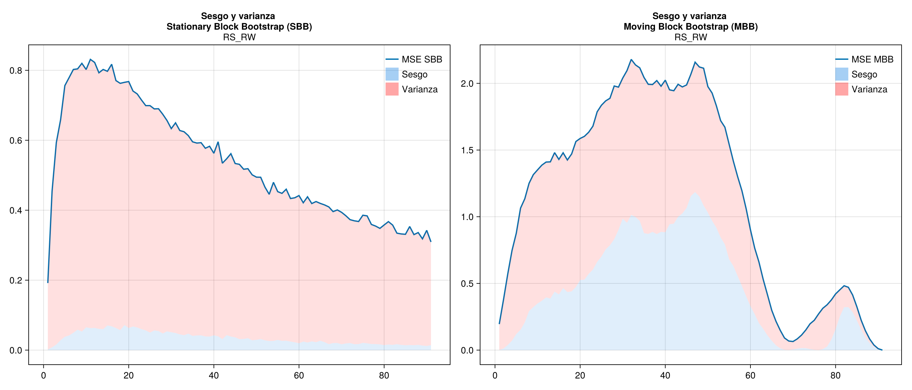
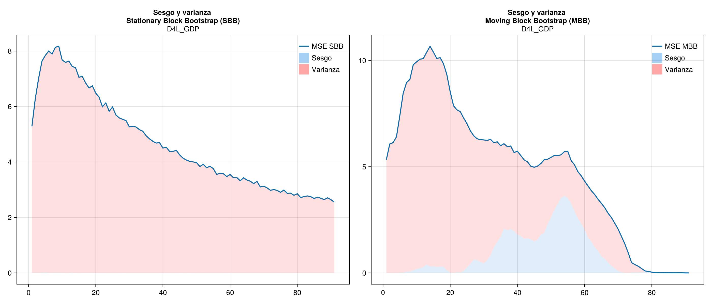
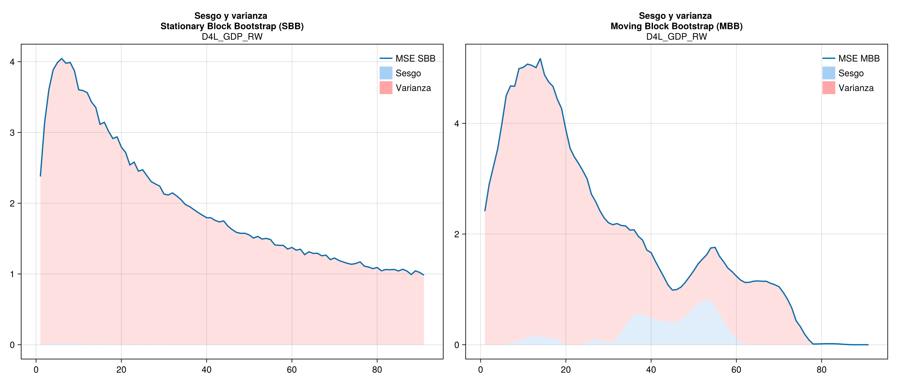
