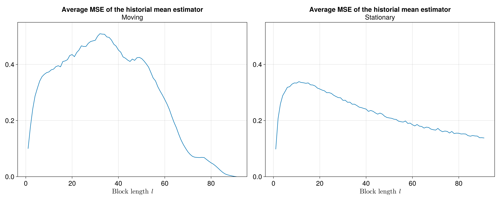
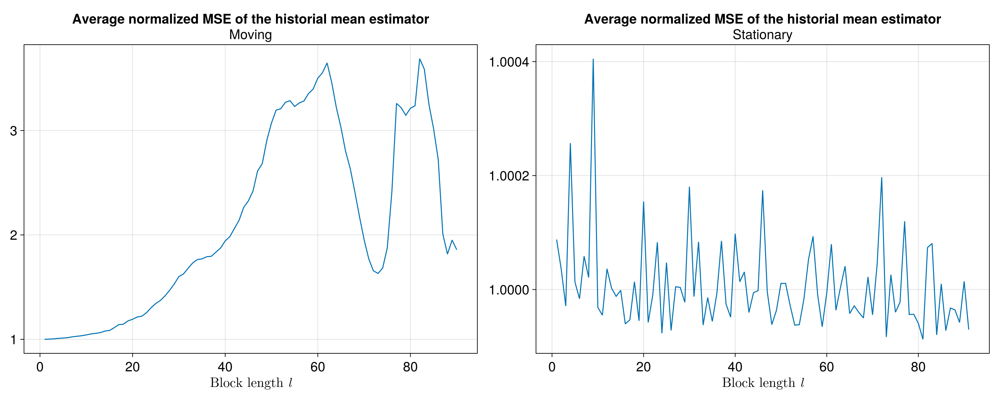
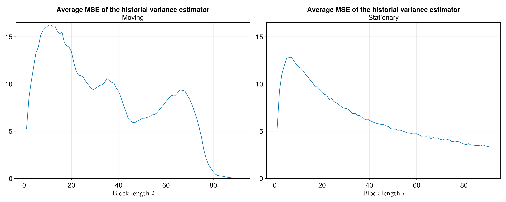
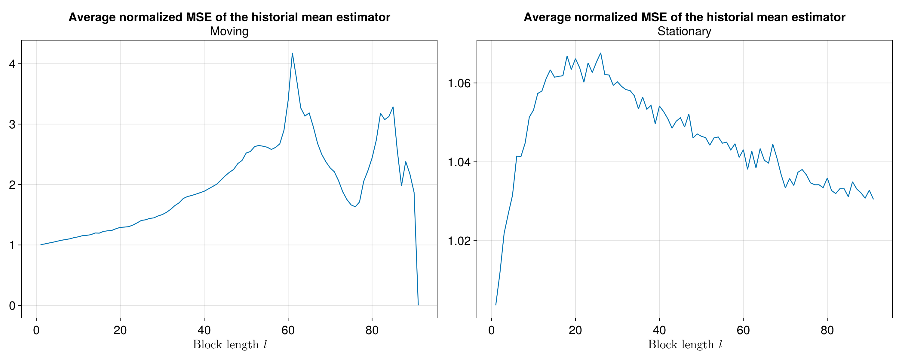
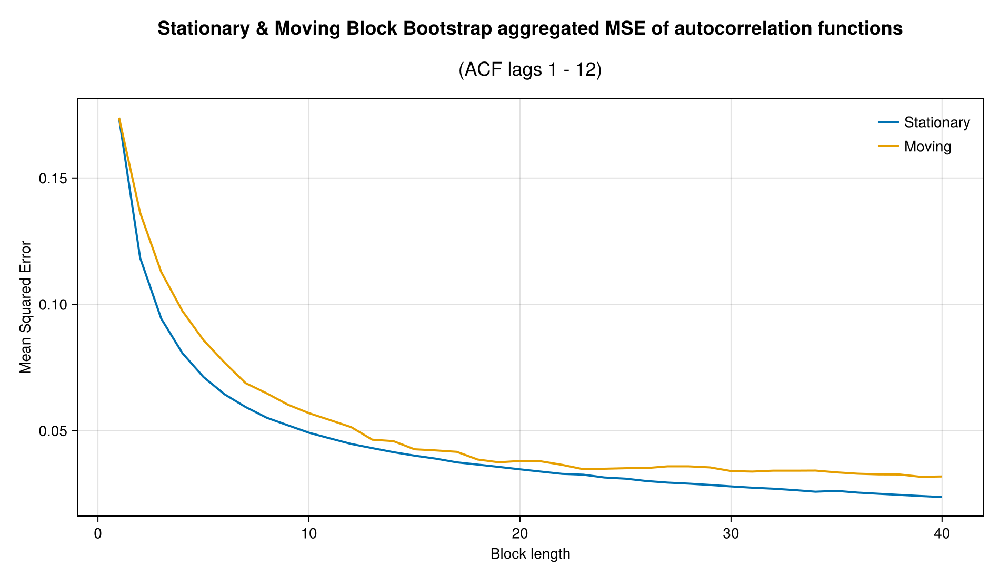
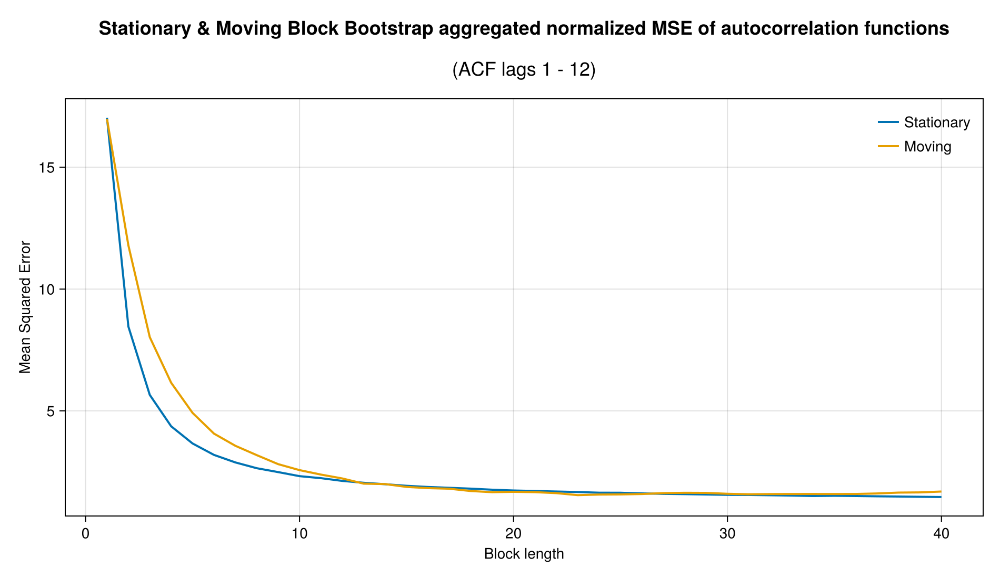
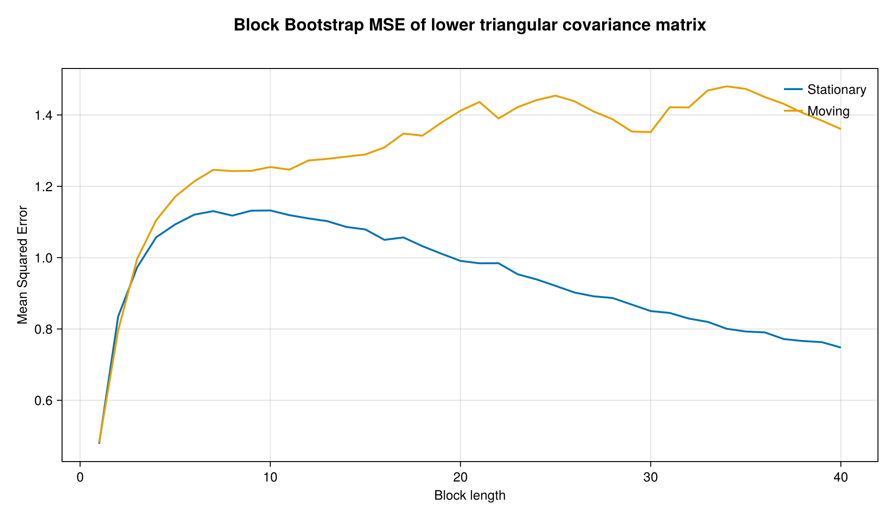
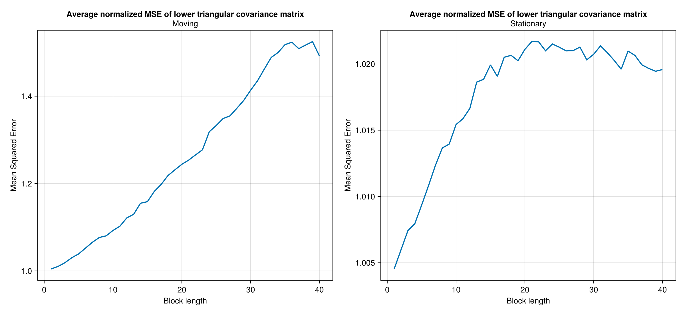

## Introduction
- We present an ad-hoc simulation study for the variables used in the macroeconomic models at DIE-BG. In our quest to assess the macroeconomic models in a robust manner, we aim to generate pseudo-test data using block bootstrap methods. This data can then be used to mimic fresh evaluation data to perform pseudo out-of-sample forecasting. 
- The purpose of the simulation study presented here is to **find suitable block lengths** for the stationary and moving block bootstrap methods.

## Bootstrap Methods
- In the literature, we can find different methods for dependent data. 
- Some of them are regarded as "first generation methods" and take as basis fixed-length blocks or variable-length blocks of observations from the original time series.
- Blocks are resampled in an independent manner until forming a replication of the time series (usually of the same length as the original sample).
- We present a brief description of these methods.

## Moving Block Bootstrap (MBB)
- We start from a given sample $X_n \equiv \{X_1,...,X_n\}$ of size $n$. Then, we define a block of length $l$, with $l$ being a number that satisfies $1\leq l  \leq n$.
- Once we have defined the block length, we form different blocks of length $l$ contained in $X_n$ as follows.

$$\begin{aligned}
B_{1} & =\left(X_{1},X_{2},...,X_{l}\right)\\
B_{2} & =\left(X_{2},X_{3},...,X_{l+1}\right)\\
\vdots & =\vdots\\
B_{N} & =\left(X_{n-l+1},...,X_{n}\right)
\end{aligned}$$

where $N = n-l+1$ denotes the number of total blocks of length $l$ that will be formed and over which the bootstrap will be applied, allowing overlapping of the blocks in each iteration until the original sample length is reached.

## Stationary Block Bootstrap (SBB)
- The SBB method shares with the MBB the characteristic of working with blocks of time series that, when joined together, generate a "single block" of length $N$ as in the original sample.
- The difference between the SBB and the MBB is that the block length in the SBB changes at each iteration, and in the MBB, the length is fixed. The algorithm as follows:

Let $X_1^*$ be an observation *drawn at **random** from the original $N$ observations*. $X_1^*$ is the **first observation** of the first block, so $X_1^*$ is defined as $X_1^* = X_{I_1}$. The next one has probability $p$ of being randomly drawn from the original $N$ observations and probability $1-p$ of being $X_2^* = X_{I_1+1}$ which be the next one in the original sample. The process ends when the $X_j^*$ is to be drawn at random from the original $N$ observations, this being the first observation of the next block. The iteration ends when we have a number of blocks that being joined together formed a *"single block"* of length $N$. So, the average length of the blocks is $1/p$.

## Basic Simulation Exercise
- In our exercise, the objetive is to sample pseudo datasets using bootstrapping methods on the time series used for building macroeconomic models.

The time series considered are year-on-year rates of change, in quarterly frequency, of the following variables:

::::{.columns}
:::{.column}
1. Real GDP of the US (D4L\_GDP\_RW)
2. PCE core inflation (D4L\_CPI\_RW)
3. Effective Federal Funds Rate (RS\_RW)
4. Domestic real GDP (D4L\_GDP)
5. Total domestic inflation (D4L\_CPI)
:::

:::{.column}
6. Domestic core inflation (D4L\_CPIXFE)
7. Exchange rate (GTQ/USD) (D4L\_S)
8. Monetary base (D4L\_MB)
9. Monetary policy rate (RS)
:::
::::

--- 

To check the correct replication of the statistical properties, we computed important statistics for our purposes. These are:

::::{.columns}
:::{.column}
1. The sample mean of each of the time series.
2. The variance of each of the time series.
:::

:::{.column}
3. The autocorrelation fuction up to 12 lags (or 3 years in quarterly frequency).
4. The correlation matrix between covariates.
:::
::::

## Normalized Mean Squared Error
- We use a Mean Squared Error (MSE) loss function to measure the deviations of the bootstrap methods in producing the observed statistics. 

$\text{MSE}\left(\hat{\theta}_{i}^{m}\right) =\frac{1}{B}\sum_{b=1}^{B}\left( \hat{\theta}_{i}^{m,(b)} - \theta_{i} \right)^2$

Where $\theta_{i}$ is the sample statistic in the actual sample. (This is the population parameter in the bootstrap universe.)

--- 

- The MSE is a scale-dependent measure, and thus, their units depend on the statistic we would compute the MSE. For this reason we propose using a normalized MSE, which transforms the MSE by the standard deviation of the estimator in all replications.

$\text{nMSE}\left(\hat{\theta}_{i}^{m}\right)=\frac{1}{B}\sum_{b=1}^{B}\left[\frac{\hat{\theta}_{i}^{m,(b)}-\theta_{i}}{\text{sd}\left(\hat{\theta}_{i}^{m}\right)}\right]^{2}$

- This modification allows us aggregating the error for statistics of different scales.

## Results
We will show the results of applying the two block bootstrap methods and calculating their errors using the Normalized Mean Squared Error.

<!-- Mean -results- -->
## Results for the sample mean
- The first plot shows the average of the original MSE of all series and the second one the normalized MSE.

## Results for the sample mean

## Results for the sample mean

## Results for the sample mean

We note that in both cases the method thath reduces the MSE is the stationary. However, for the normalized MSE and for all possible block lengths, the mean estimator obtained by the SBB is consistently closer to the sample mean, which means that the estimator has low bias for every block length $l$ considered.

<!-- # Variance -results- -->
## Results for the sample variance
 we follow a similar procedure for comparing between block bootstrap methods as the one used for the sample mean.

## Results for the sample variance

## Results for the sample variance

## Results for the sample variance
In both cases we prefer the SBB method as the most apropiate method to replicate the sample variance for most block lengths.

<!-- # autocorrelation function -results- -->
## Results of the sample autocorrelation function
- For the autocorrelation fuction analysis we have an additional dimension (i.e. the lags of the autocorrelation function entries) to determine the error with respect to the sample autocorrelation function.

- In our excercise we consider only 12 lags to generate the sample autocorrelation function. In particular we have an array of dimension $13 \times 10 \times 40 \times 10000$:

::::{.columns}
:::{.column}
- 12 lags (plus lag 0).
- 10 variables
:::

:::{.column}
- 40 possible block lengths
- 10,000 pseudo time series (block bootstrap series)
:::
::::

## Results of the sample autocorrelation function

## Results of the sample autocorrelation function

## Results of the sample autocorrelation function
For both the MBB and the SBB (and for their normalized version of the MSE), the error decays significantly in the first 10 possible block lengths. This property is very important because it tells us about a continuously decaying error for the SBB and a minimum error in the MBB method.

<!-- # correlation matrix -results- -->
## Results of the sample correlation matrix
In the same way as the autocorrelation function, the correlation matrix adds an additional dimension to the analysis to determine the error with respect to the sample correlation matrix.

## Results of the sample correlation matrix

## Results of the sample correlation matrix

## Results of the sample correlation matrix
Consistent with others statistics, the SBB method is the best to replicate the sample correlation matrix characteristics for the different block lengths.

## Unified metric for comparing block bootstrap metrics
As we have four different main statistics that we are concerned the bootstrap samples replicate from the dataset, we propose comparing block bootstrap methods (and possibly other resampling methodologies) by an aggregation of the normalized MSEs for: 

1. Mean
2. Variance
3. autocorrelation function
4. correlation matrix between covariates

## Unified nMSE for the mean
Hereafter, let $i$ index a variable and $m$ a block bootstrap method. Let $\hat\mu_{i}^{m}$ the sample mean estimator. We form the mean component of the unified metric by averaging over covariates:

$\text{nMSE}\left(\hat{\mu}^{m}\right)=\frac{1}{K}\sum_{k=1}^{K}\text{nMSE}\left(\hat{\mu}_{k}^{m}\right)$

## Unified nMSE for the variance
Similarly to the mean, for the sample variance estimator, $\hat{\sigma^2}_{i}^{m}$, we form the variance component of the unified metric by averaging over covariates: 

$\text{nMSE}\left(\hat{\sigma^{2}}^{m}\right)=\frac{1}{K}\sum_{k=1}^{K}\text{nMSE}\left(\hat{\sigma^{2}}_{k}^{m}\right)$

## Unified nMSE for the autocorrelation function
Now, for the autocorrelation function we are evaluating its closeness to the one computed on the whole sample using up to 12 lags. 
Let $\hat\gamma_{i,l}^{m}$ the $l$-th entry of the sample autocorrelation function, where $l=1,\ldots,12$. (Note $\hat\gamma_{i,0}^{m}=1$ always.)  
We again combine the MSE for each of the entries of the autocorrelation function using a decaying exponential weighted average as follows: 

$\text{nMSE}\left(\hat{\gamma}_{i}^{m}\right)=\frac{1}{\bar{\alpha}}\sum_{l=1}^{12}\alpha^{i-1}\text{nMSE}\left(\hat{\gamma}_{i,l}^{m}\right)$

Then, the autocorrelation component of the unified metric is computed by averaging over covariates:

$\text{nMSE}\left(\hat{\gamma}^{m}\right)=\frac{1}{K}\sum_{k=1}^{K}\text{nMSE}\left(\hat{\gamma}_{k}^{m}\right)$

## Unified nMSE for the autocorrelation function
for the correlation between covariates, we follow a similar approach as for the autocorrelation. We average over the normalized MSEs of the sample correlation statistics below the main diagonal of the correlation matrix.

Let $\hat\rho_{i,j}^{m}$ be the sample correlation between covariates $i$ and $j$ under block bootstrap method $m$. We compute the correlation component as follows:

$\text{nMSE}\left(\hat{\rho}^{m}\right)=\frac{2}{K\left(K-1\right)}\sum_{i=1, j<i}^{K}\text{nMSE}\left(\hat{\rho}_{i,j}^{m}\right)$

## Unified nMSE for all statistics
In sum, the unified metric for bootstrap method $m$, $\text{unMSE}\left(m\right)$, is defined as the sum of four components: 

$\text{unMSE}\left(m\right)=\text{nMSE}\left(\hat{\mu}^{m}\right)+\text{nMSE}\left(\hat{\sigma^{2}}^{m}\right)+\text{nMSE}\left(\hat{\gamma}^{m}\right)+\text{nMSE}\left(\hat{\rho}^{m}\right)$

## Results of Unified nMSE
In the following figure, we plot the four components of the unified metric as a function of the block length:

We can see that the autocorrelation dominates the normalized error decomposition because the bias is too high for small block lengths.

## Results of Unified nMSE
In the following figure, we show the behavior of the other three components:

Then, we compute the sum of the four components to get the unified metric.

## Results of Unified nMSE
As we can see in the figure below, the total error decays quickly with the block length for both block methods. The MBB exhibits a minimum at $l=19$. Althought the SBB does not exhibit a minimum value, we find that 95% of the total decrease in the error occurs at a block length $l=10$.

This result is, of course, contingent on the maximum block length explored for the resampling, which is $40$ for the figure above. However, we re-run the experiment with a maximum block length of $90$ (almost the number of observations in the dataset) and find that the 95% decrease in the total error occurs at the block length $l=11$.

## Optimal block size from the literature
- We compare our insights about the block length with the methodology of  Patton, Politis y White (hereafter, PPW). They derive a procedure for obtaining the optimal block length for a time series using spectral methods.

- The optimal block size estimator in the paper uses a criterion based on minimizing the asymptotic mean squared error of the stationary bootstrap variance estimator.

- Based on a theorem of Lahiri Politis and White (2004), the MSE criterion in PPW is as follows: 

$\text{MSE}\left(\hat{\sigma}_{b,SB}^{2}\right)=\frac{G^{2}}{b^{2}}+D_{SB}\frac{b}{N}+o\left(b^{-2}\right)+o\left(b/N\right),$ 

- The main difference between our method and the PPW method is that our method is applied jointly to all macroeconomic series and the PPW method is applied individually to each series.

## Results of Patton, Politis and White method
- The figure shows the results of applying PPW to each of the time series in our dataset.

- We can see that most series require a block length of less than 10.

- time series like core inflation (D4L_CPIXFE) and the year-on-year change of the exchange rate (D4L_S) require a higher block length, as they are more persistent.

- Both the *median and the mean* are **around 10**, which is the optimal block size per SBB according to the methodology we proposed in the present work. 

## References
::: {#refs}
:::
